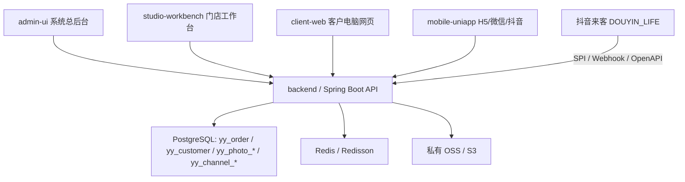

# 影约云企业相馆管理系统

## 结论

这是面向照相馆/摄影机构的企业级 SaaS 管理系统，正式主线采用 `RuoYi-Vue-Plus + plus-ui + PostgreSQL + Redis`。当前仓库已整理为干净交付结构，参考下载仓库、综合架构草案、构建产物、真实环境变量和本地截图输出不进入版本库。

当前接手朋友项目和多端取片时，优先看：

```text
docs/00-authoritative-friend-project-takeover-20260609.md
```

`D:\OtherProject\CameraApp\photoshop-master` 和 `D:\OtherProject\CameraApp\yuyue-main` 只作为参考资产；正式开发仍在本仓库的 `admin-ui`、`studio-workbench`、`client-web`、`mobile-uniapp`、`backend`。客户取片、小程序和抖音来客推荐统一走 `https://api.evanshine.me`。

`C:\Users\Administrator\Downloads\综合架构设计(1).md` 已评审吸收：不换技术栈，不新建第二套预约/支付账本；综合设计中的统一订单、平台适配器、同步日志和小程序上线事项映射到现有 `yy_order`、`yy_channel_order_mapping`、`yy_channel_sync_log`、`mobile-uniapp`。详见 `docs/comprehensive-architecture-absorption-20260611.md`。

## 目录结构

```text
backend/            企业后端，含 yy 业务模块、PostgreSQL SQL、导入脚本
admin-ui/           企业后台前端，含 7 个标红优先功能页面
studio-workbench/   门店员工 PC 工作台，处理订单、排期、客片、选片、核销和异常
client-web/         客户电脑网页端，提供官网、客户取片入口和小程序预约引导
mobile-uniapp/      H5 / 微信小程序 / 抖音小程序客户取片端
prototype-next/     Next.js 原型和验收样板，保留用于流程/视觉对照
docs/               PRD 差距审计、路线图、验收和部署说明
tools/              备份与页面验证脚本
```

## 前后端入口

| 目录 | 类型 | 面向用户 | 主要职责 | 常用命令 |
| --- | --- | --- | --- | --- |
| `client-web` | Vue 3 / Vite 客户网页 | 客户可见 | 门店官网、客户取片、小程序预约引导；不维护网页预约表单，不调用 `/client/booking/intent` | `npm run dev`、`npm run build`、`npm test` |
| `mobile-uniapp` | uni-app 多端客户端 | 客户可见 | H5、微信小程序、抖音小程序取片；P0 负责手机号 + 取片码相册访问 | `npm run dev:h5:api`、`npm run build:h5`、`npm run build:mp-weixin`、`npm run build:mp-toutiao` |
| `studio-workbench` | Vue 3 / Vite 门店工作台 | 店员/门店运营 | 今日预约、订单处理、排期库存、客片上传、选片交付、核销和异常处理 | `npm run dev`、`npm run build`、`npm test`、`npm run check:file-size` |
| `admin-ui` | RuoYi-Vue-Plus 后台前端 | 管理员/系统运营 | 系统总后台，全渠道订单、主数据、渠道配置、权限和后台管理 | `npm run dev`、`npm run build:prod`、`npm run test:yy` |
| `backend` | Spring Boot / RuoYi-Vue-Plus 后端 | 前端和第三方平台 | 统一 API、权限、订单账本、客片、库存、渠道同步、OSS 鉴权、SPI/Webhook | `mvn -pl ruoyi-admin -am -DskipTests package` |

## 后端模块边界

| 目录 | 作用 |
| --- | --- |
| `backend/ruoyi-admin` | Spring Boot Web 服务入口，打包运行的主应用，依赖 `ruoyi-yy` 业务模块 |
| `backend/ruoyi-modules/ruoyi-yy` | 影约云核心业务模块，包含 controller、service、channel adapter、domain、mapper 和 XML mapper |
| `backend/script/sql` | 基础库表、PostgreSQL 结构、历史迁移和 yy 业务迁移脚本 |
| `backend/tools` | 本地导入、代码生成等后端辅助脚本 |
| `backend/ruoyi-common`、`backend/ruoyi-modules/ruoyi-system` | RuoYi 公共能力和系统模块，提供权限、租户、MyBatis、OSS、日志等基础能力 |

## 运行关系



边界口径：

- `yy_order` 是统一订单/预约账本；不要新建第二套预约账本。
- `client-web` 只做官网、取片和小程序预约引导；客户预约下单走微信/抖音小程序。
- `studio-workbench` 只处理门店履约动作，不承载客户公开预约表单。
- `admin-ui` 看全渠道订单、主数据、系统配置和权限，不替代客户侧入口。
- `mobile-uniapp` 是正式 H5/微信/抖音取片客户端，朋友项目或 Taro 源码只作体验参考。

## 核心技术栈

| 层 | 选型 |
| --- | --- |
| 后端 | Spring Boot 3.5 + Java 17 + MyBatis-Plus + Sa-Token |
| 后台前端 | Vue 3 + TypeScript + Element Plus |
| 门店工作台 | Vue 3 + TypeScript + Vite + Tailwind CSS |
| 客户网页端 | Vue 3 + TypeScript + Vite |
| H5 / 小程序 | uni-app + Vue 3 |
| 数据库 | PostgreSQL |
| 缓存 | Redis / Redisson |
| 文件 | MinIO / S3 / 服务器挂载目录 |
| 原型 | Next.js 16 + React 19 + Prisma |

## P0 优先功能

- `B-029` 预约订单列表
- `B-002` 预约概况
- `B-008` 门店管理
- `B-022` 在线选片配置
- `C-020` 底片/选片列表
- `B-026` 抖店产品插件
- `B-027` 美团产品插件

## 企业第二批模块

第二批已补进主线骨架，详见 `docs/enterprise-next-batch.md`：

- 预约配置：服务组、排期规则、容量校验
- 员工管理：员工台账、用户绑定、订单分配
- 客户管理：客户档案、预约历史、消费汇总
- 通知中心：模板、发送日志、微信/短信/企微预留
- 多端预约：H5、小程序、App 入口配置
- 经营报表：日报快照、渠道统计、选片收入

## PostgreSQL 初始化

```powershell
createdb -h 127.0.0.1 -p 5432 -U postgres yingyue_cloud

cd .\backend
.\tools\import-yy-cloud.ps1 -Engine postgres -DbHost 127.0.0.1 -Port 5432 -Database yingyue_cloud -User postgres -IncludeBaseSchema -IncludeDemoData
```

后端运行前设置：

```powershell
$env:DB_URL="jdbc:postgresql://127.0.0.1:5432/yingyue_cloud?useUnicode=true&characterEncoding=utf8&sslmode=disable&reWriteBatchedInserts=true"
$env:DB_USERNAME="postgres"
$env:DB_PASSWORD="你的本地数据库密码"
$env:REDIS_PASSWORD="你的本地Redis密码"
```

## 验证命令

后端：

```powershell
cd .\backend
mvn -pl ruoyi-admin -am -DskipTests package
```

后台前端：

```powershell
cd .\admin-ui
pnpm install
pnpm build:prod
```

门店工作台：

```powershell
cd .\studio-workbench
npm install
npm run build
```

客户电脑网页：

```powershell
cd .\client-web
npm install
npm run build
```

H5 / 小程序取片端：

```powershell
cd .\mobile-uniapp
npm install
npm run build:h5
npm run build:mp-weixin
npm run build:mp-toutiao
```

原型：

```powershell
cd .\prototype-next
npm install
npm run build
```

## 安全要求

- 不提交真实 `.env`、数据库密码、Redis 密码。
- 不提交抖店/美团/微信的 `app_secret`、`access_token`、`refresh_token`。
- 前端 RSA 密钥必须按环境生成，仓库只保留 `.env.example` 占位。
- 渠道回调原文可存 PostgreSQL `jsonb`，但敏感字段入库前要加密或脱敏。
