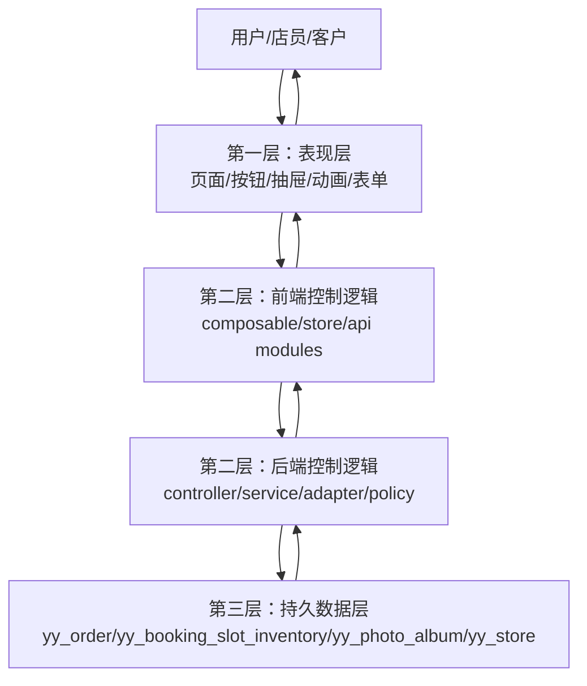
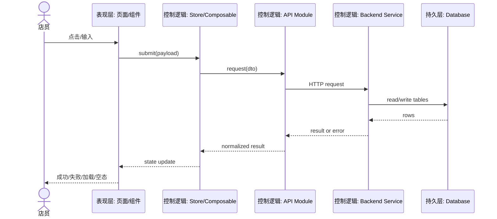

# 影约云三层楼架构规范

> owner: yingyue-three-layer-architecture
> canonical_for: 三层楼架构、规格驱动开工流程、跨层依赖方向
> upstream: `AGENTS.md`, `C:\Users\Administrator\Desktop\yiyue\code_map.md`
> downstream: feature plans, contract docs, flow docs, refactor tasks

## 目标

影约云所有新功能、重构、修复都按三层楼组织：

1. **表现层**：用户看到和点击的界面。
2. **控制逻辑层**：业务大脑，负责校验、状态机、路由、接口编排、第三方适配。
3. **持久数据层**：数据库表、Mapper、外部平台事实源、文件存储。

这不是命名装饰。每次开工前必须说明功能跨三层如何流转，谁传什么数据，谁返回什么结果，失败如何处理。

## 三层定义

| 层级 | 职责 | 当前项目位置 | 禁止事项 |
| --- | --- | --- | --- |
| 表现层 | 页面、按钮、表格、抽屉、动画、提示、空态、加载态、失败态 | `studio-workbench/src/features/**`, `mobile-uniapp/**` | 不直接拼后端路径；不直接写数据库语义；不把业务状态机散落在模板里。 |
| 控制逻辑层 | 路由 query、表单校验、状态流转、权限判断、API facade、Store、后端 Service、Douyin adapter | `studio-workbench/src/shared/api/**`, `studio-workbench/src/shared/stores/**`, `features/**/composables/**`, `backend/**/controller/**`, `backend/**/service/**`, `backend/**/channel/**` | 不吞错误；不绕过契约；不把 `DOUYIN_LIFE` 和 `DOUYIN_MINI_APP` 混用。 |
| 持久数据层 | 库表、Mapper、SQL、对象存储、第三方平台真实 payload | `backend/**/domain/**`, `backend/**/mapper/**`, `backend/**/resources/mapper/**`, SQL scripts, Douyin OpenAPI/SPI payload evidence | 不伪造历史时段；不写未验证字段；不输出 secrets/raw 私密 payload。 |

## 依赖方向

表现层只能依赖控制逻辑层；控制逻辑层通过契约读写持久层；持久层不反向依赖 UI。

## 规格驱动开工顺序

任何非平凡任务先产出四件东西，再写代码：

1. **用户路径**：谁从哪个页面点哪里，成功后看到什么。
2. **Mermaid 数据流图**：三层每一站、传入字段、返回字段、失败路径。
3. **接口/对象契约**：请求、响应、错误、状态机、权限、幂等性。
4. **执行计划**：分几步、改哪些文件、影响哪些模块、验证命令。

简单文案、样式微调可以跳过完整契约，但仍要说明影响文件和验证方式。

## 标准 Mermaid 模板

## 当前核心链路归属

| 链路 | 表现层 | 控制逻辑层 | 持久数据层 |
| --- | --- | --- | --- |
| 首页今日预约 | `DashboardView.vue`, `DashboardSlotBoard.vue` | `useDashboardSlotBoard`, `dashboardOperations`, `backendApi`, backend schedule/order services | `yy_booking_slot_inventory`, `yy_order`, `yy_store` |
| 预约订单详情 | `OrdersView.vue`, `OrderDetail*.vue` | `useOrderDetailState`, `useOrderMutations`, `ordersApi`, backend order service | `yy_order`, `sys_oper_log`, channel sync logs |
| 改期/取消/状态流转 | Order drawer panels | `useOrderMutations`, `useOrderOperationLogs`, backend transition/reschedule/cancel services | `yy_order`, `yy_booking_slot_inventory`, `sys_oper_log` |
| 客片通知/确认/资料发送 | `PhotoMgmtView.vue`, `OrderAlbum*.vue` | `usePhotoActions`, `albumsApi`, backend photo album service | `yy_photo_album`, `yy_photo_asset`, `yy_photo_access_log` |
| 抖音来客同步 | Channel/settings/order UI | `douyinApi`, `DouyinLifeChannelAdapter`, resolver, sync service | `yy_order`, `yy_channel_product_mapping`, `yy_channel_sync_log`, Douyin payload evidence |

## 完成定义

一个功能只有同时满足以下条件才算完成：

- 表现层入口、空态、加载态、失败态明确。
- 控制逻辑层有唯一 owner，不在多个页面重复实现同一状态机。
- 持久数据层的读写表和字段明确。
- 接口契约已写入 `docs/contracts` 或相关地图。
- 数据流图已写入 `docs/flows` 或执行计划。
- 至少一条可复制验证命令通过。
