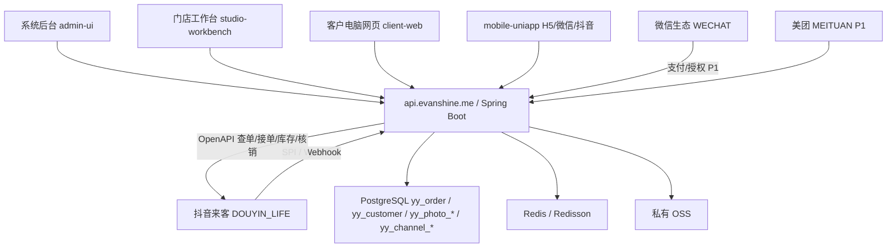

# 综合架构吸收与技术栈结论

日期：2026-06-11

## 结论

不换技术栈，不新起一套 `platforms / customers / appointments / payment_orders` 数据库。

`C:\Users\Administrator\Downloads\综合架构设计(1).md` 的方向是正确的：统一后台、统一数据库、平台适配器、Upsert 同步、同步日志、统一订单导出。但它更像从零开始的通用设计，当前影约云已经有正式生产基线，应把它吸收到现有 `yy_*` 模型里，而不是推倒重建。

正式主线保持：

| 层 | 继续使用 |
| --- | --- |
| 核心后端 | Spring Boot / RuoYi-Vue-Plus / MyBatis-Plus / Sa-Token |
| 数据库 | PostgreSQL |
| 缓存与锁 | Redis / Redisson |
| 系统后台 | `admin-ui`，Vue 3 + Element Plus |
| 门店工作台 | `studio-workbench`，摄影门店 PC 工作台 |
| 客户电脑网页 | `client-web`，客户官网、预约、取片 |
| H5 / 微信 / 抖音小程序 | `mobile-uniapp`，一套代码多端构建 |
| 正式 API 域名 | `https://api.evanshine.me` |
| 图片存储 | 私有 OSS + 后端鉴权 + 短期签名 URL 或 `/stream` |

## 为什么不换

| 候选 | 结论 | 原因 |
| --- | --- | --- |
| Taro / React 小程序 | 不替换 | 朋友小程序只作体验参考；正式微信/抖音已统一在 `mobile-uniapp`，减少双端维护成本。 |
| Node.js / Express / Koa | 不替换 | 当前订单、相册、渠道、权限、OSS、SPI 已在 Spring Boot 跑通，换后端会重做验签、权限和账本。 |
| 微信云 / 抖音云 | 不承载主账本 | 可做平台登录、手机号授权、轻量 BFF；主订单、相册、客户、OSS 权限仍在 Spring Boot。 |
| 新建通用表 `appointments/payment_orders` | 不直接采用 | 现有 `yy_order` 是统一订单账本，`yy_channel_order_mapping` 是外部订单映射，重复建表会造成双账本。 |
| 公共读 OSS / 图床系统 | 不进入正式链路 | 正式必须保持私有 OSS，客户端不暴露长期直链。 |

## 综合设计到现有模型映射

| 综合文档概念 | 正式落点 | 当前判断 |
| --- | --- | --- |
| `platforms` 平台来源 | `yy_channel_plugin`、`yy_channel_account`、`yy_mobile_channel_config` | 已有渠道插件、账号、移动端配置，不新建。 |
| `customers` 客户 | `yy_customer` | 已有手机号唯一客户档案。P1 再按真实授权情况新增平台身份子表或扩展字段。 |
| `services` 服务项目 | `yy_product`、`yy_service_group`、`yy_channel_product_mapping` | 已有产品/服务组和外部商品映射。平台差异价格/时长先落映射表备注或后续专列。 |
| `time_slots` 时间段库存 | `yy_schedule_rule`、`yy_booking_slot_inventory`、`yy_channel_inventory_slot` | 排期规则定义可售时段；`yy_booking_slot_inventory` 是本地全渠道容量锁；`yy_channel_inventory_slot` 只保留为抖音平台库存镜像和联调记录。 |
| `appointments` 统一预约 | `yy_order` | `yy_order` 是统一预约/订单账本，`source/channel_type` 区分来源。 |
| `(platform, platform_appointment_id)` 唯一约束 | `yy_channel_order_mapping(tenant_id, channel_type, external_order_id)` | 已有唯一约束，满足 Upsert 幂等。 |
| `payment_orders` 支付订单 | `yy_order` 支付摘要 + `yy_payment_record` 自建支付流水 | `DOUYIN_LIFE` P0 支付事实来自抖音来客订单；小程序内 `tt.pay` 或微信支付 P1 使用 `yy_payment_record`。 |
| `sync_tasks / sync_task_errors` | `yy_channel_sync_log` | 已有同步日志。后续若需要批次级任务视图，再补批次表。 |
| 原始平台数据 `raw_data` | `yy_channel_order_mapping.raw_payload`、`yy_channel_sync_log` | 已保留原始摘要，敏感字段必须脱敏或加密。 |

## 修正后的分层架构



## 同步与订单规则

- 平台侧订单/预约是外部事实来源，本地 `yy_order` 是影约云运营账本。
- 抖音来客 `DOUYIN_LIFE`：优先通过 SPI / Webhook 入站，必要时用 OpenAPI 主动同步补偿。
- 微信/抖音小程序：P0 只做客户取片；P1 支付或手机号授权成功后再写本地订单或绑定客户身份。
- Upsert 幂等键统一使用：`tenant_id + channel_type + external_order_id`。
- 同步日志统一进 `yy_channel_sync_log`，保留 `logid/request_id`，不记录明文 secret/token/完整 openid。
- 库存展示和防超卖以 `yy_booking_slot_inventory` 为准；`DOUYIN_LIFE` 支付事实来自平台订单/支付通知，自建支付线来自微信支付或 `tt.pay` 回调。

## 抖音真实订单与支付结论

| 问题 | 结论 | 落库方式 |
| --- | --- | --- |
| 抖音能不能发出真实订单 | 能。`DOUYIN_LIFE` 用户在抖音来客团购/预约商品页下单后，抖音通过 SPI / Webhook 通知影约云，影约云也可以用 `goodlife/v1/trade/order/query/` 主动查单补偿。 | `yy_order` 生成本地订单，`yy_channel_order_mapping` 记录抖音订单号和原始摘要。 |
| 抖音能不能真实支付 | 能。`DOUYIN_LIFE` 的付款发生在抖音侧，影约云不调起收银台，只接收支付成功事实并写本地账本。 | `yy_order.pay_status=PAID`、`paid_time`、金额摘要；原始订单事实在映射表和同步日志里。 |
| 抖音小程序能不能自己收款 | 能，但这是 P1。需要开通小程序担保支付后，前端调 `tt.pay`，后端负责预下单、验签回调和补偿查询。 | `yy_payment_record` 保存 `out_trade_no`、平台交易号、支付状态和回调报文。 |

已新增结构脚本：

```text
backend/script/sql/postgres/postgres_yy_order_payment_migration_20260611.sql
```

执行原则：

- 老库执行迁移脚本，补 `yy_order` 支付字段和 `yy_payment_record`。
- 新库使用 `postgres_yy_cloud.sql`，已包含同样结构。
- 不把综合文档里的 `appointments/payment_orders` 原样导入，避免双账本。

## P0 / P1 / P2 继续推进

| 优先级 | 目标 | 具体动作 |
| --- | --- | --- |
| P0 | 保持现有闭环稳定 | 私有 OSS 真实图验收、H5/微信/抖音取片、抖音来客真实订单同步、统一订单导出。 |
| P0 | 平台配置完成 | 微信/抖音小程序合法域名都填 `https://api.evanshine.me`；抖音 SPI/Webhook 继续用 `/api/douyin/life/*`。 |
| P1 | 平台身份子表 | 等微信/抖音手机号授权真实接入后，评估新增 `yy_customer_platform_account`，不要先用 JSON 混存。 |
| P1 | 支付记录接入 | `yy_payment_record` 结构已预留；等 `DOUYIN_MINI_APP tt.pay` 或微信支付落地后接预下单、支付回调、补偿查询。 |
| P1 | 同步批次视图 | 在 `yy_channel_sync_log` 已够用前不加复杂 MQ；订单量上来后再补批次表、失败重试队列或 XXL-JOB。 |
| P2 | 队列与异步化 | 单店/早期订单量不引入 Kafka/RabbitMQ；多商户高并发后用 Redis 队列/XXL-JOB 先行，Kafka 只作为远期。 |

## 当前最短完成路径

1. 后台上传一组真实私有 OSS 照片，生成最终 PASS 证据。
2. 微信开发者工具导入 `mobile-uniapp\dist\build\mp-weixin`，用手机号 + 取片码验收。
3. 抖音开发者工具导入 `mobile-uniapp\dist\build\mp-toutiao`，用同一链路验收。
4. 抖音来客配置真实下单入口，用户在来客商品页付款后同步到 `yy_order`。
5. 后台订单页先同步、再筛选、再导出全渠道订单。
6. 上线前再补手机号授权、短信验证码、支付 P1，不阻塞 P0 取片闭环。

## 不做的事

- 不把 `综合架构设计(1).md` 里的 SQL 直接导入生产库。
- 不把 `yy_order` 和新 `appointments` 双写。
- 不把抖音生活服务 SPI 移到小程序或云函数。
- 不为了预览图片把 OSS 改成公共读。
- 不在仓库和地图里记录 AppSecret、AccessKey、token、完整 openid。

## 渠道事件收件箱 yy_channel_event_inbox

综合架构中“消息推送 + 补偿拉取”的思路已落到当前 Spring Boot 后端，不换技术栈：

| 表/服务 | 职责 |
| --- | --- |
| `yy_channel_event_inbox` | 订单类 Webhook/SPI 入站收件箱，保存 `order-create/pay-notify` 脱敏事件、幂等键、处理状态、错误信息 |
| `yy_channel_order_mapping` | 外部订单号和本地 `yy_order` 的业务映射 |
| `yy_channel_sync_log` | OpenAPI 调用、自动同步、手动补偿和验收 `logid` |
| `YyDouyinLifeAutoSyncService` | 定时补偿同步，默认小窗口、带安全上限 |
| `DouyinLifeChannelAdapter.handleLifeSpi(...)` | 接收抖音来客 SPI/Webhook，先入箱，再落单 |

状态口径：

- `RECEIVED`：已收到事件，仍可继续处理或重试。
- `PROCESSED`：处理成功，后续同一事件按重复处理。
- `FAILED`：处理失败，保留错误信息，允许补偿重试。
- `DUPLICATE`：已确认重复，不再二次落单。

幂等规则：只有 `PROCESSED` 才算完成幂等；`RECEIVED/FAILED` 不能当作已完成，否则进程在入箱后崩溃会造成永久丢单。`eventId` 优先使用平台外部订单号，避免同一订单因为 logid 或 JSON 空白变化生成多个事件。
