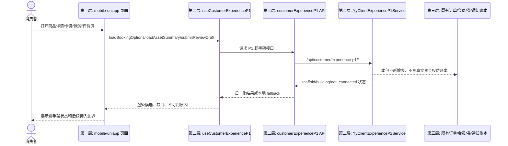
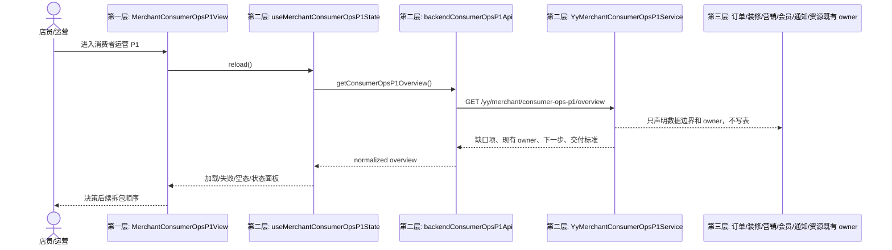

# P1 消费者体验与商户运营闭环脚手架数据流

生成时间：2026-06-25



```mermaid
sequenceDiagram
  actor Customer as 消费者
  participant ProductPage as 第一层: 商品详情预约页
  participant CustomerApi as 第二层: createCustomerOrder
  participant PublicSvc as 第二层: YyClientPublicApiService
  participant Order as 第三层: yy_order

  Customer->>ProductPage: 选择服务组/填写资料项/选择权益候选
  ProductPage->>CustomerApi: POST /api/customer/orders(serviceGroupId, customFields, entitlement*)
  CustomerApi->>PublicSvc: ClientCustomerOrderCreateBo
  PublicSvc->>Order: 写 service_group_id; remark 追加 P1 scaffold 信息
  PublicSvc-->>CustomerApi: 返回订单摘要
  CustomerApi-->>ProductPage: 继续原支付流程
  Note over PublicSvc,Order: 不新增表; 不写真实权益预占/核销/扣减
```



## 失败路径

- 客户端接口失败：开发环境走 `VITE_CUSTOMER_API_FALLBACK` 本地 fallback，生产环境透出错误 toast。
- 商户端接口失败：聚合页展示错误块，允许手动刷新。
- 未接入真实账本：返回 `scaffold` 或 `not_connected`，不返回“已完成”。
