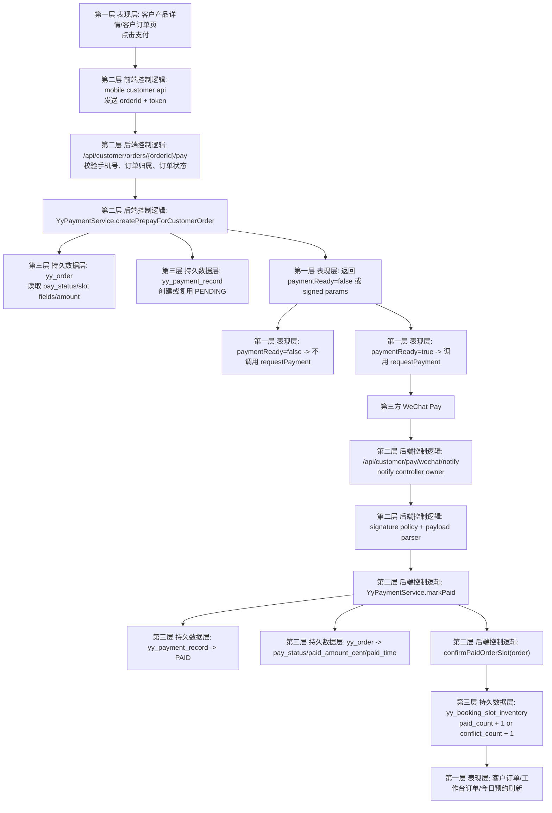
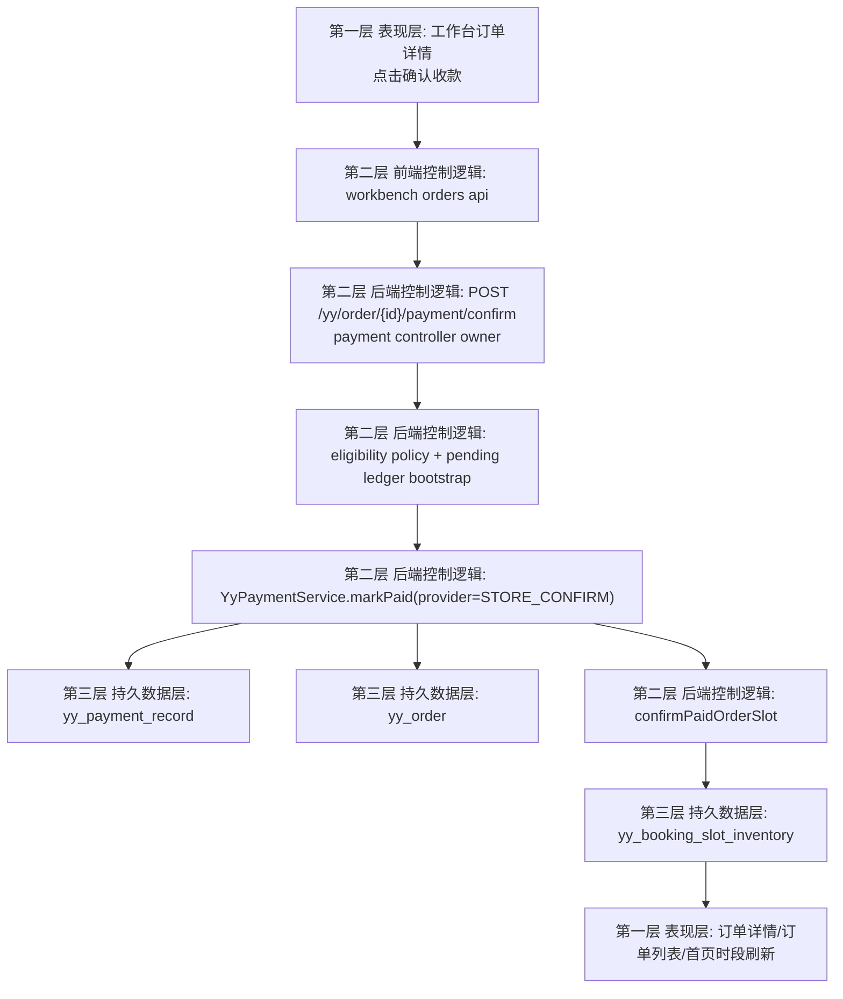
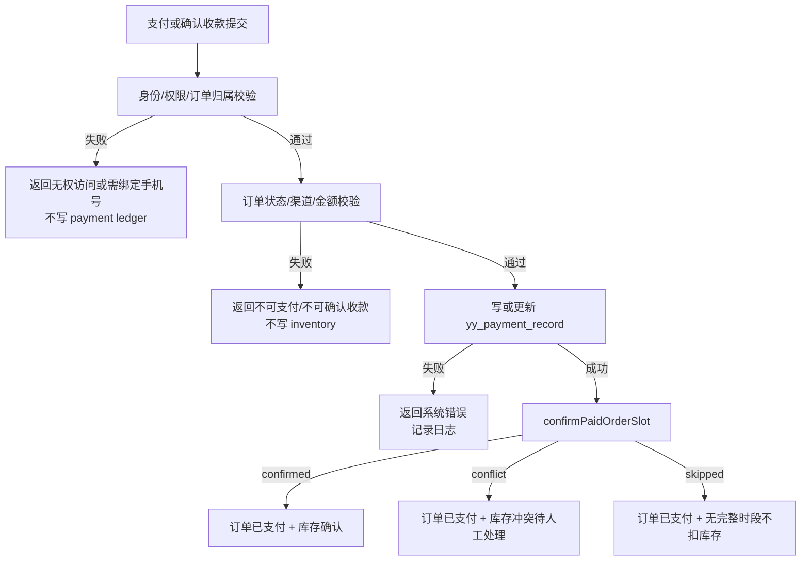

# Customer Payment Inventory Closed-Loop Flow 2026-06-24

## Conclusion

Part 3 closes one normalized payment-success loop:

```text
客户下单 -> 发起支付或门店确认收款 -> 写 payment ledger -> 更新 order pay status -> 确认库存或标记冲突 -> 客户端和工作台刷新
```

It still does not lock real refund, member assets, or Douyin platform write-back.

## Verified Entry Points

- Customer create order: `POST /api/customer/orders`
- Customer pay order: `POST /api/customer/orders/{orderId}/pay`
- Inventory confirmation service: `confirmPaidOrderSlot(YyOrder order)`
- Store-confirm entry owner: `POST /yy/order/{id}/payment/confirm`
  - code owner: `backend/ruoyi-modules/ruoyi-yy/src/main/java/org/dromara/yy/controller/YyOrderPaymentController.java:34`
- WeChat notify entry owner: `POST /api/customer/pay/wechat/notify`
  - code owner: `backend/ruoyi-modules/ruoyi-yy/src/main/java/org/dromara/yy/controller/YyWechatPaymentNotifyController.java:23`

## User Path 1: Customer Self-Service Payment Placeholder

1. Customer opens product detail or customer orders page.
2. Customer submits order and receives one local `UNPAID` order.
3. Customer taps pay.
4. Backend verifies bound phone and local order ownership.
5. If WeChat pay config is unavailable, backend returns `paymentReady=false`.
6. Mobile client does not call `uni.requestPayment`.
7. Customer sees explicit fallback message and the order stays unpaid.

Success UI:

- show clear fallback message
- keep order in unpaid state

Failure UI:

- show auth/order-state error returned by backend

## User Path 2: Customer Self-Service Payment with Real Prepay

1. Customer taps pay on an eligible unpaid order.
2. Backend verifies ownership, order status, and local-channel eligibility.
3. Backend creates or reuses one `PENDING` payment record.
4. Backend returns `paymentReady=true` plus signed pay params and `outTradeNo`.
5. Mobile client calls `uni.requestPayment`.
6. Real paid fact is not written here; it waits for notify or explicit reconciliation.

## User Path 3: WeChat Notify Success

1. WeChat calls notify endpoint.
2. Notify controller owner delegates to signature policy and normalized payload parser.
3. Backend loads `yy_payment_record` by `out_trade_no`.
4. Backend validates amount and target order.
5. Backend calls unified `markPaid(...)`.
6. `markPaid(...)` updates payment record and order payment summary.
7. `markPaid(...)` calls inventory confirmation once.
8. Customer orders and workbench orders refresh to paid state.

Failure path:

- invalid signature, missing order, missing payment record, or amount mismatch stops paid write
- failure must be logged without forging paid state

## User Path 4: Workbench Store-Confirm Receipt

1. Staff opens workbench order detail for an unpaid local order.
2. Staff clicks `确认收款`.
3. Workbench posts `amountCent` and `remark`.
4. Frontend request owner is `studio-workbench/src/shared/api/backend.ts:479`.
5. Payment controller owner checks permission `yy:order:edit`.
6. Entry service runs store-confirm eligibility policy.
7. Backend fixes provider to `STORE_CONFIRM` and creates or reuses one pending payment ledger.
8. Backend calls unified `markPaid(...)`.
9. Backend writes payment record, updates order paid fields, confirms inventory or marks conflict.
10. Workbench detail and related lists refresh.

## User Path 5: Illegal Order Rejection

Rejected cases:

- unauthorized customer identity
- no bound phone
- cancelled order
- refunded order
- already paid order
- non-local channel order such as `DOUYIN_LIFE`

Expected result:

- no `yy_payment_record` effective write
- no inventory mutation
- UI sees explicit rejection message

## User Path 6: Inventory Conflict After Paid Entry

1. Payment fact succeeds.
2. Inventory service resolves real slot identity.
3. Atomic slot increment fails because capacity is full.
4. Order remains paid.
5. Inventory is marked conflict.
6. Paid fact is not rolled back by this conflict path.
7. Workbench follows up by reschedule or refund flow in a later phase.

## Three-Layer Main Flow



## Workbench Store-Confirm Branch



## Failure Flow



## Read/Write Summary

| Step | Read | Write |
| --- | --- | --- |
| Customer pay entry | `yy_order`, optional existing `yy_payment_record` | `yy_payment_record` `PENDING` |
| WeChat notify paid entry | `yy_payment_record`, `yy_order` | `yy_payment_record` `PAID`, `yy_order` pay fields |
| Store-confirm paid entry | `yy_order`, optional existing `yy_payment_record` | `yy_payment_record`, `yy_order` pay fields |
| Inventory confirmation | `yy_order`, `yy_booking_slot_inventory` | `yy_order.inventory_*`, `yy_booking_slot_inventory.paid_count/conflict_count` |

## UI State Rules

| State | Customer UI | Workbench UI |
| --- | --- | --- |
| Loading | Disable pay button and show submitting status | Disable confirm button and show processing state |
| Placeholder | Show payment unavailable message | Not applicable |
| Paid success | Refresh order detail/list to paid | Refresh drawer/list/dashboard to paid |
| Inventory conflict | Customer may only see paid state; later UX can add notice | Must show conflict/manual follow-up cue |
| Failure | Show explicit error returned by backend | Show explicit error and keep unpaid state |

## Verification

```powershell
rg -n "payCustomerOrder|confirmPaidOrderSlot|yy_payment_record|paymentReady" backend/ruoyi-modules/ruoyi-yy mobile-uniapp studio-workbench docs
```
