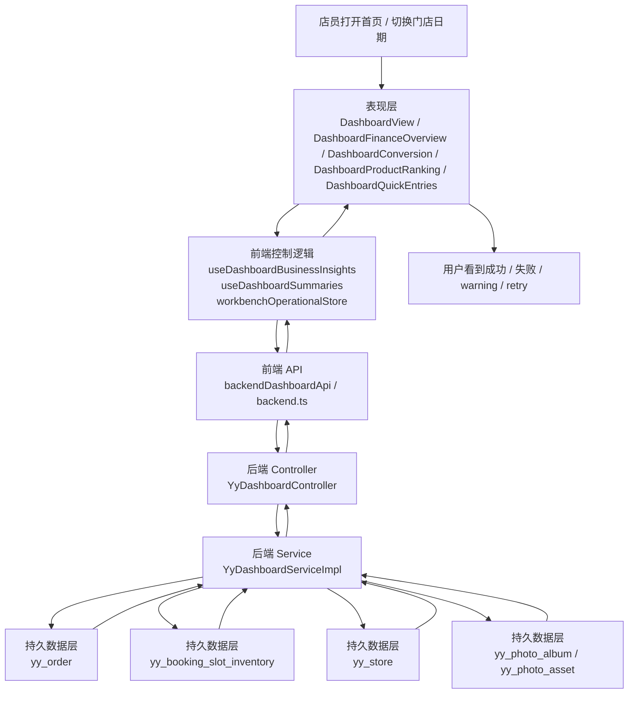
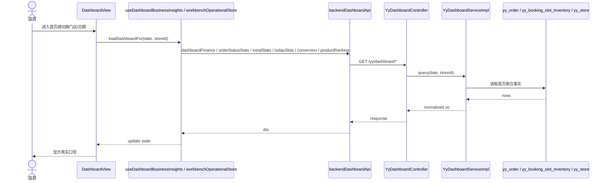
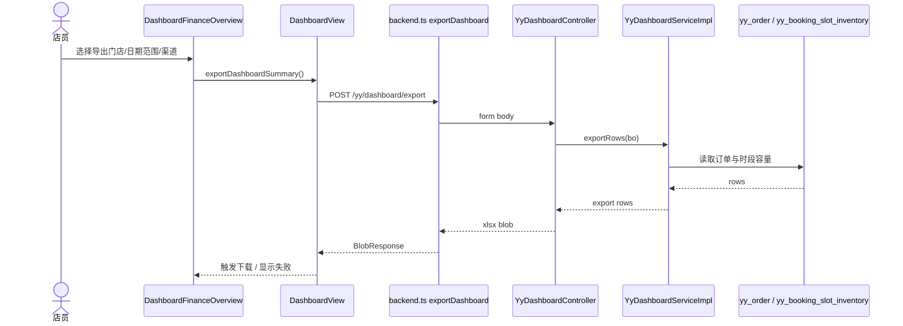
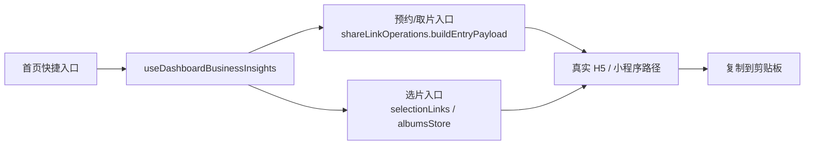
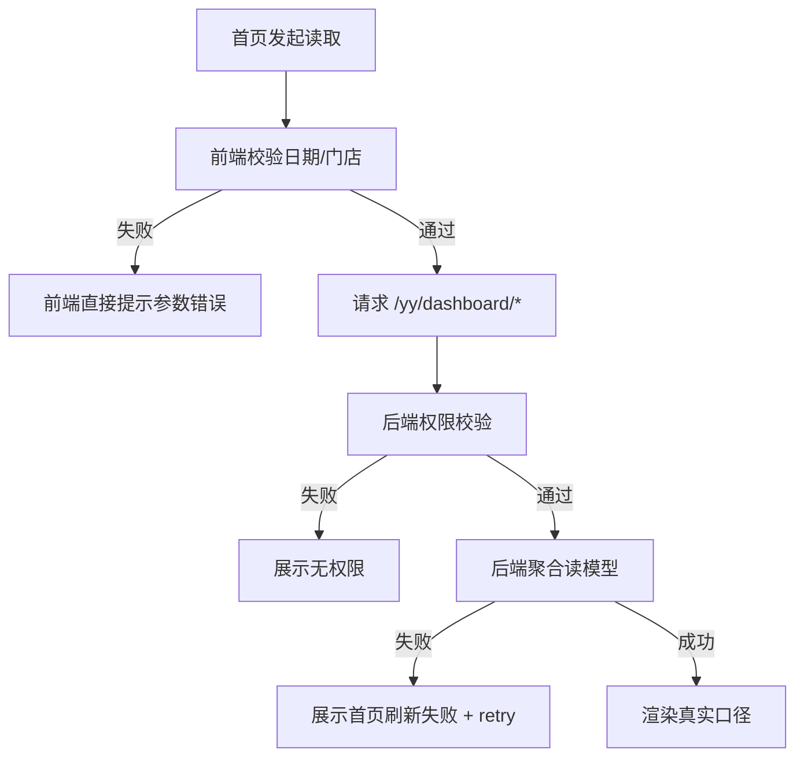

# 首页模块收口数据流

> owner: dashboard-home-close-gap
> canonical_for: 商户工作台首页收口的数据流、失败路径、读模型边界
> upstream: `docs/contracts/dashboard-home-close-gap-contract.md`, `docs/architecture/three-layer-standard.md`
> downstream: 首页实现、测试、handoff

## 1. 用户路径

### 1.1 首页指标刷新

1. 店员进入工作台首页 `/`
2. 选择门店、日期
3. 页面并发刷新：
   - 经营概况
   - 状态卡
   - 趋势
   - 今日时段
   - 转化率
   - 产品排行
4. 成功时显示真实后端读模型
5. 失败时展示统一错误提示与重试入口，不伪装完整口径

### 1.2 首页导出

1. 店员在经营概况区域选择导出开始日期、结束日期、渠道、导出门店
2. 点击“导出”
3. 前端调用 `POST /yy/dashboard/export`
4. 成功下载 Excel；失败显示导出错误

### 1.3 快捷入口复制

1. 店员在首页点击“复制预约入口 / 取片入口 / 选片入口”
2. 前端优先生成真实客户入口 URL
3. 复制成功显示已复制；参数不完整时显示不可复制原因

## 2. 首页读模型三层图



## 3. 首页刷新时序



## 4. 导出时序



## 5. 快捷入口数据流



说明：

- 预约、取片入口复用 `shareLinkOperations.ts`，不新增新表、不新增新接口。
- 选片入口复用现有 `selectionLinks` 刷新链路。

## 6. 失败路径



## 7. 写库表 / 读接口 / UI 状态

| 项 | 内容 |
| --- | --- |
| 写库表 | 无 |
| 读接口 | `/yy/dashboard/finance`、`/yy/dashboard/order-status-stats`、`/yy/dashboard/trend-stats`、`/yy/dashboard/today-slots`、`/yy/dashboard/product-ranking`、`/yy/dashboard/conversion`、`/yy/dashboard/export` |
| 空态 | 当前日期暂无数据，显示空态和切换建议 |
| 加载态 | 首页卡片 skeleton / loading hint |
| 失败态 | `StateView` + retry；经营概况展示 warning 来源 |
| 风险边界 | 不伪造访客 UV，不新增第二账本，不把历史无时段订单写入今日时段 |

## 8. 验证

```powershell
npm --prefix studio-workbench run test -- src/features/dashboard/DashboardView.contract.test.ts src/shared/api/backend.contract.test.ts src/shared/stores/appStore.contract.test.ts
npm --prefix studio-workbench run build
cd backend
mvn -pl ruoyi-modules/ruoyi-yy -Dtest=YyDashboardServiceImplTest test
```
