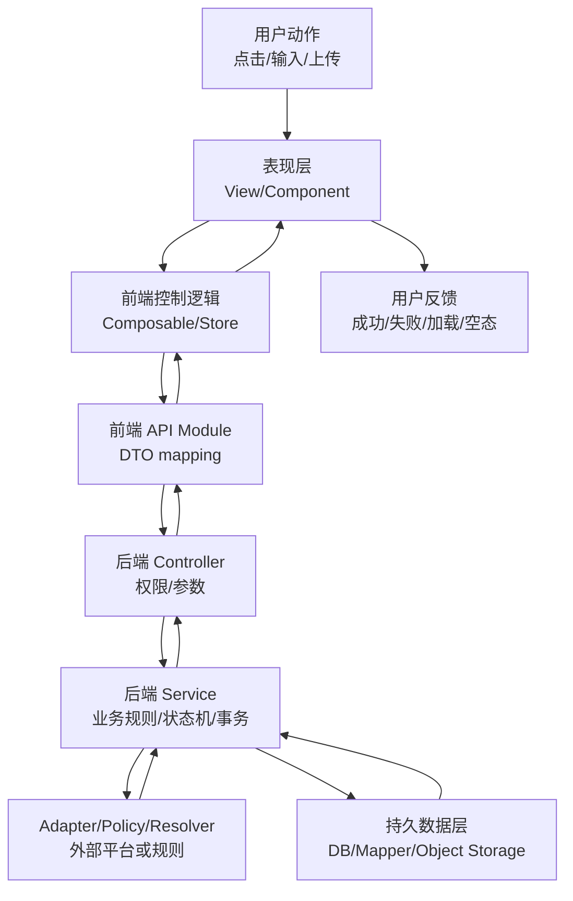
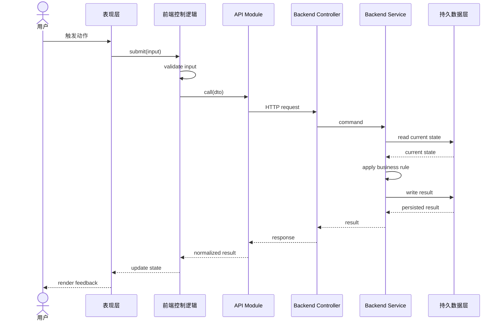
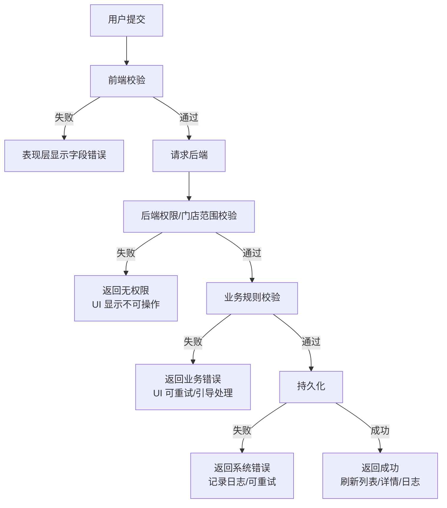

# 影约云 Mermaid 数据流模板

> owner: yingyue-flow-template
> canonical_for: 开工前数据流图、三层调用路线、错误路径表达
> upstream: `docs/architecture/three-layer-standard.md`
> downstream: feature flow docs, implementation plans, handoff docs

## 使用规则

当用户说“先不要写代码，先画路线图/数据流/模块怎么配合”时，使用本模板。功能复杂时同时写 `docs/contracts/<feature>-contract.md`。

## 标准三层流程图

## 标准时序图

## 错误路径模板

## 影约云关键字段标注要求

每张图必须标出：

- `storeId` 是否为真实 `yy_store.id`。
- 订单 ID 使用前端展示 ID 还是后端 `yy_order.id`。
- 是否读写 `yy_booking_slot_inventory`。
- 是否触发外部平台 `DOUYIN_LIFE`。
- 是否需要 `logid/requestId` 证据。
- 是否可能写生产数据。

## 输出要求

图下面必须附：

| 项 | 内容 |
| --- | --- |
| 写库表 | 表名和字段 |
| 读接口 | 接口路径或 API module |
| 写接口 | 接口路径或 API module |
| 空态 | UI 如何显示 |
| 加载态 | UI 如何显示 |
| 失败态 | UI 如何显示 |
| 验证 | 命令、smoke、证据路径 |
