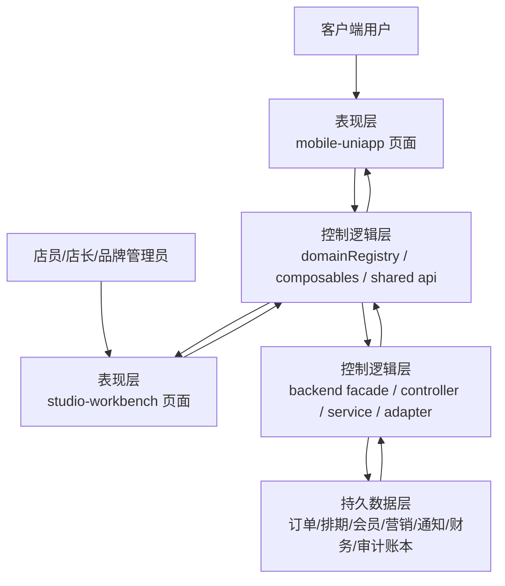
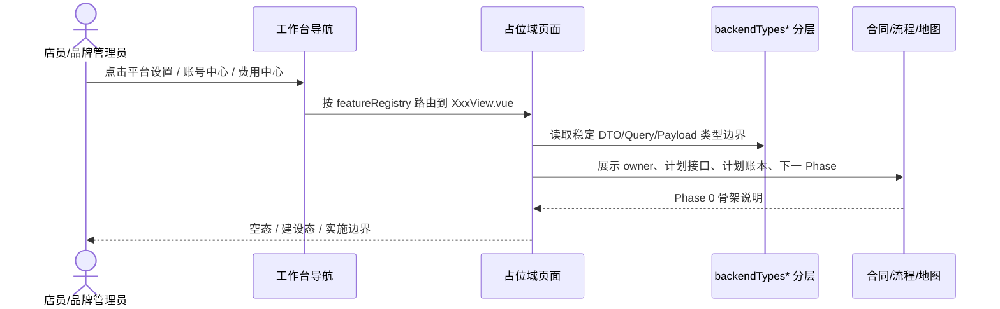
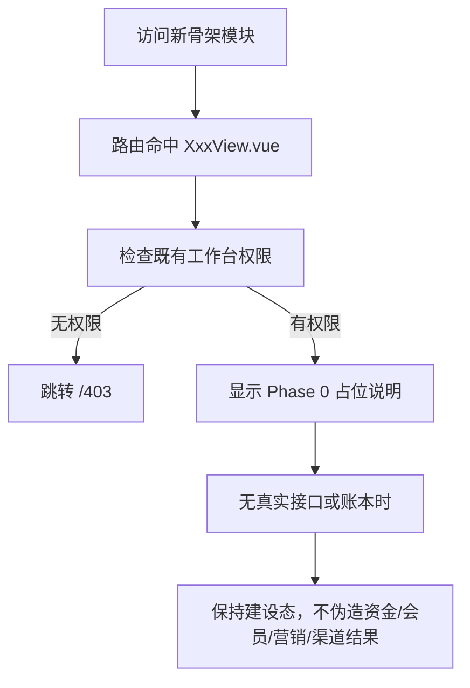

# 全产品完美复刻 Phase 0 数据流总图

> owner: full-product-closed-loop-phase0
> canonical_for: Phase 0 模块脚手架、路由分组、共享类型与地图更新
> upstream: `docs/architecture/three-layer-standard.md`, `docs/flows/flow-template.md`
> downstream: Phase 1-4 具体功能流转图

## 用户路径

1. 客户端用户从 `mobile-uniapp` 进入首页、预约、订单、底片、我的，未来再进入卡券和资料页。
2. 店员/店长从 `studio-workbench` 进入工作台首页、订单、服务、内部协作、资源、会员、营销和统计。
3. 品牌管理员通过新增的 `平台设置 / 账号中心 / 费用中心` 骨架入口确认模块边界，再逐 Phase 接真实业务。

## Phase 0 三层总图

## Phase 0 路由骨架流

## Phase 0 失败路径

## 写库与接口边界

| 模块 | Phase 0 是否写库 | 计划接口来源 |
| --- | --- | --- |
| 平台设置 | 否 | 后续对接 `/yy/*` 配置接口 |
| 账号中心 | 否 | 后续对接账号、品牌、帮助接口 |
| 费用中心 | 否 | 后续对接支付、收支、导出接口 |
| 移动端卡券/资料页 | 否 | 后续对接会员资产、个人资料接口 |

## 验证

- 工作台新组别和新路由可进入。
- 占位页明确 owner、计划接口、计划账本、下一 Phase。
- 共享类型已按域拆分。
- 外部地图已登记本轮脚手架和缺失对标地图说明。
