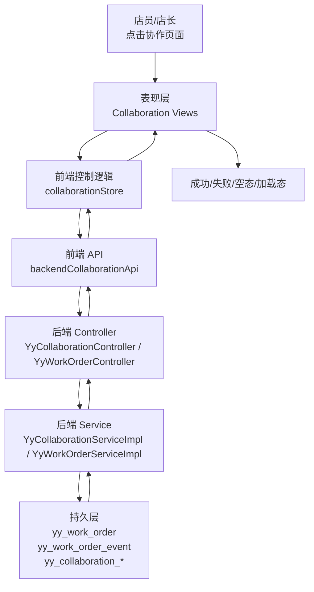
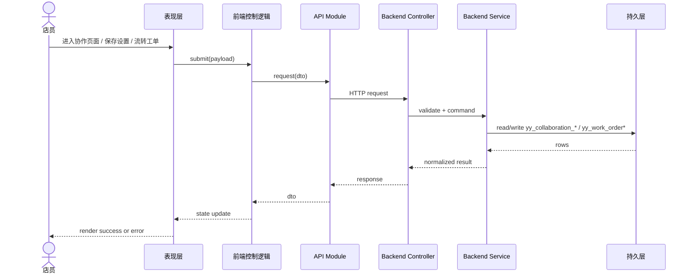

# 内部协作真实闭环数据流（2026-06-24）

## 关键字段标注

| 项 | 内容 |
| --- | --- |
| `storeId` | 使用真实 `yy_store.id` |
| 订单 ID | 使用真实 `yy_order.id` |
| 工单 ID | 使用真实 `yy_work_order.id` |
| 写库表 | `yy_work_order`、`yy_work_order_event`、`yy_collaboration_setting`、`yy_product_collaboration_config`、`yy_collaboration_license`、`yy_collaboration_license_store` |
| 外部平台 | 本轮不触发 `DOUYIN_LIFE` |
| 证据 | 流转失败和接口错误保留 `requestId/logid` |
| 生产写入 | 是，协作配置和工单真实写库 |

## UI 状态要求

| 项 | 内容 |
| --- | --- |
| 空态 | 无工单时显示“暂无协作工单”；无许可证时显示“当前未配置协作许可证” |
| 加载态 | 页面骨架屏或按钮 loading |
| 失败态 | 顶部提示 + 区域内错误卡片，不吞后端消息 |
| 验证 | `npm --prefix studio-workbench run build`；`mvn -f backend/pom.xml -pl ruoyi-modules/ruoyi-yy -am -DskipTests=false test` |
