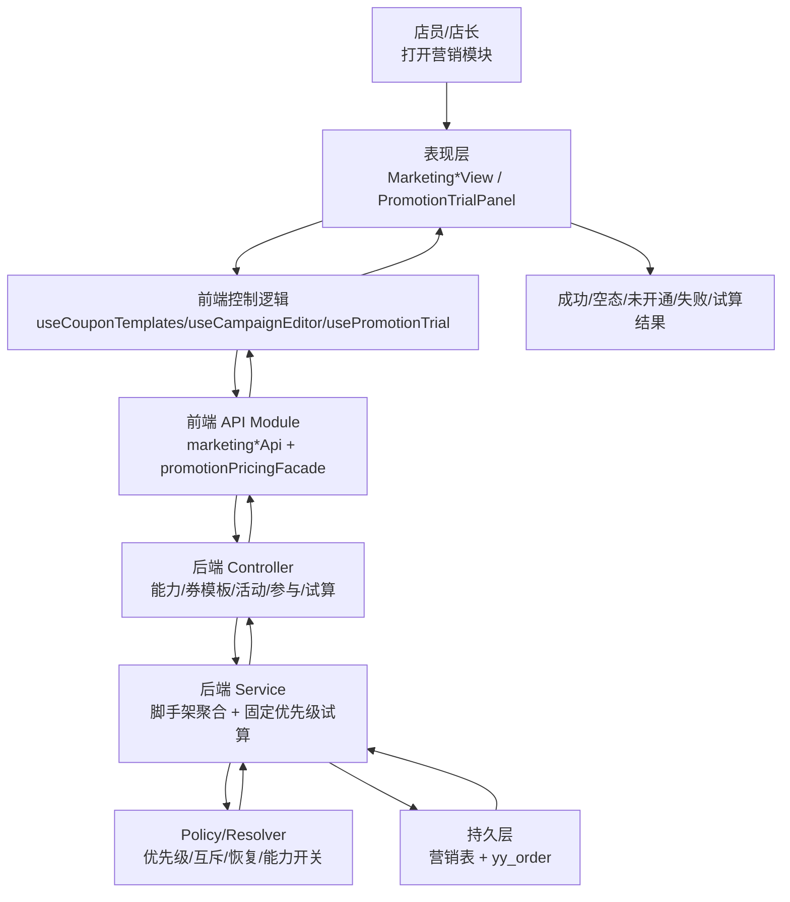
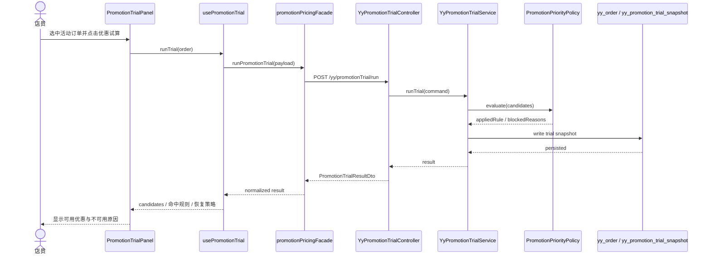
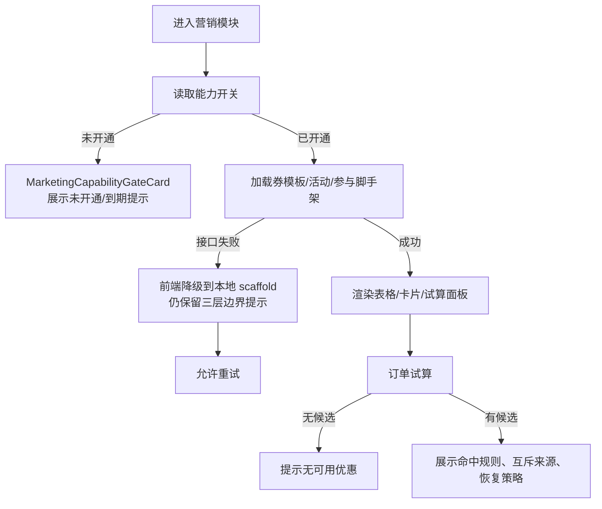

# 营销域脚手架数据流

| 项 | 内容 |
| --- | --- |
| 写库表 | `yy_coupon_template`、`yy_coupon_instance`、`yy_coupon_grant_record`、`yy_coupon_writeoff_record`、`yy_campaign`、`yy_campaign_product`、`yy_campaign_participation`、`yy_promotion_capability`、`yy_promotion_trial_snapshot` |
| 读接口 | `GET /yy/marketingCapability/list`、`GET /yy/marketing/dashboard`、`GET /yy/couponTemplate/scaffold`、`GET /yy/campaign/scaffold`、`GET /yy/campaignParticipation/scaffold` |
| 写接口 | `POST /yy/promotionTrial/run` |
| 空态 | 显示“脚手架就绪，等待真实账本或运营数据接入” |
| 加载态 | 卡片骨架屏 + 表格 loading 文案 |
| 失败态 | 能力开关失败显示统一错误条；试算失败保留原价并提示重试 |
| 验证 | `npm --prefix studio-workbench run test -- src/features/marketing/*.test.ts src/features/orders/*promotion*.test.ts`、`mvn -pl backend/ruoyi-modules/ruoyi-yy -Dtest=*Promotion* test` |
