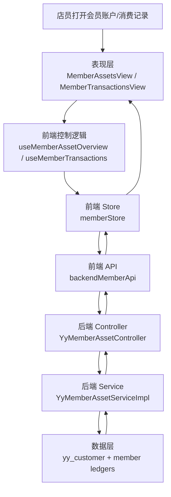
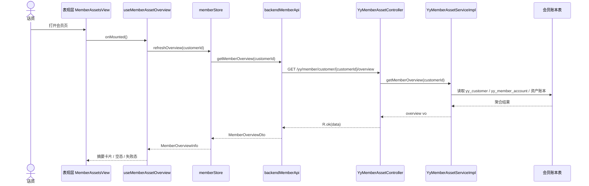
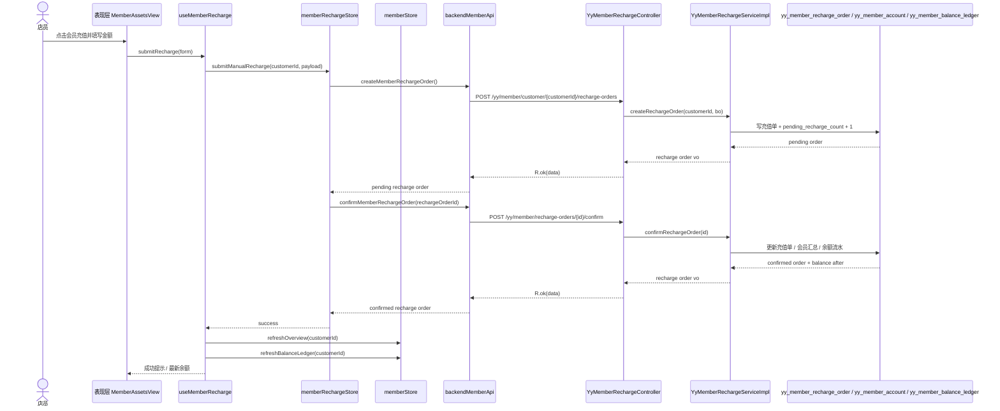
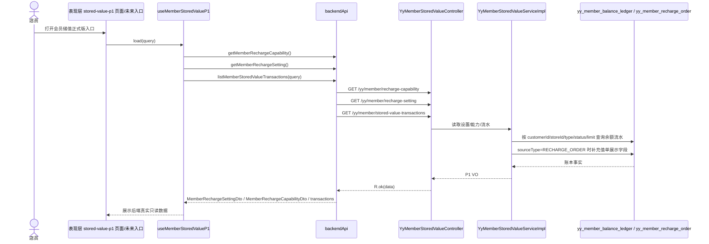

# 会员模块数据流 2026-06-24

## 2026-06-24 手工充值闭环补充

### 失败路径

- 建单失败：弹窗内提示错误，不写任何余额变更。
- 确认失败：保留 `PENDING` 充值单，`pending_recharge_count` 不回滚，留待后续人工补确认。
- 刷新失败：充值成功但页面提示刷新失败，用户可手动重进会员页。

## 验证

- `npm --prefix studio-workbench run test -- src/features/member/modules/assets/MemberAssetsView.contract.test.ts src/features/member/modules/transactions/MemberTransactionsView.contract.test.ts src/shared/api/backend.contract.test.ts src/app/router/featureRegistry.contract.test.ts src/app/router/featureRegistry.access.test.ts`
- `npm --prefix studio-workbench run check:file-size`
- `mvn -f backend/pom.xml -pl ruoyi-modules/ruoyi-yy -am -DskipTests compile`

## 2026-06-24 储值 P1 只读链路

### 失败路径

- 三个读取接口任一失败时，前端 `useMemberStoredValueP1` 保留本地 scaffold fallback。
- 普通员工指定越权 `storeId` 时，后端拒绝读取，不返回跨门店流水。
- 当前不生成消费、提现、退款回滚等未落地写链路的数据，只展示余额流水已有事实。
