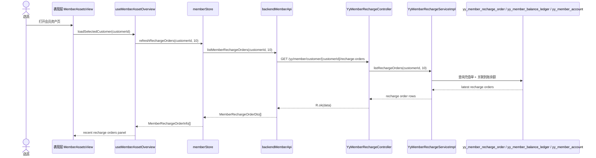

# Member Recharge Read Side Flow 2026-06-25

## Failure Path

- 客户不存在：后端拒绝读取，前端显示错误态，不缓存旧客户的充值单。
- 门店范围越权：后端返回无权限错误，前端保留当前页面结构和失败提示。
- 充值成功但刷新失败：写链路结果仍保留在 `memberRechargeStore.lastRechargeByCustomer`，店员可重新进入页面触发读侧刷新。
