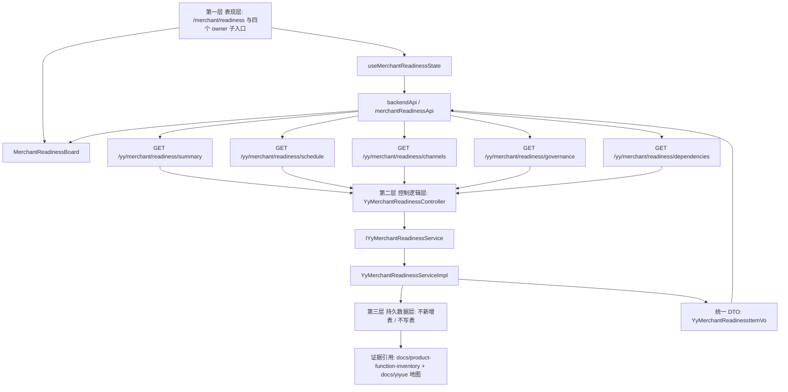

# 商家 readiness 三层数据流

更新时间：2026-06-25

## 用户路径

运营人员进入工作台后，从商户分组点击 `闭环脚手架`，页面加载门店上下文和 readiness 分区。成功时看到模块状态、优先级、阻塞原因、下一步动作和证据引用；失败时看到加载失败状态并可重试。

## Mermaid 数据流

## 失败路径

- 前端接口失败：`useMerchantReadinessState.errorMessage` 接收错误，`MerchantReadinessBoard` 展示失败态和重试按钮。
- 无门店上下文：页面仍按全局 readiness 展示，不发起任何真实写操作。
- 缺真实表或真实状态源：后端返回 `BLOCKED`、`PARTIAL` 或 `BUILDING`，不得返回 `READY`。

## 独立 owner 入口

- `/merchant/schedule-governance`：只读消费 `schedule` section，对应 `B-016`、`B-017`、`X-013`。
- `/merchant/channel-readiness`：只读消费 `channels` section，对应 `B-026`、`B-027`、`B-045`、`B-046`。
- `/merchant/governance`：只读消费 `governance` section，对应 `P-003`、`P-004`、`P-005`、`P-006`。
- `/merchant/dependency-readiness`：只读消费 `dependencies` section，对应 `X-001`、`X-002`、`X-003`、`X-004`、`B-068`、`B-069`、`R-014`、`R-015`。

## 验收边界

- 本任务只搭脚手架，不运行测试流程、不部署、不触碰真实第三方写接口。
- 后续验收应单独验证：路由可打开、五个只读接口返回统一 DTO、地图能追溯 sourceItems、没有新增写库和外部写调用。
