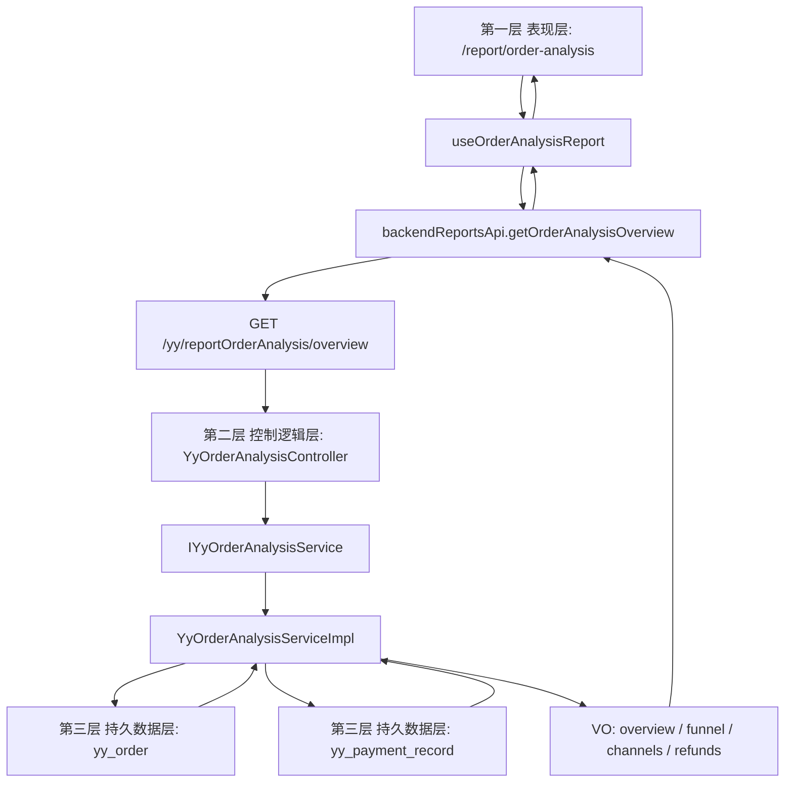

# R-013 订购分析三层数据流

更新时间：2026-06-26

## 用户路径

店员进入工作台 `统计 -> 订购分析`，打开 `/report/order-analysis`。页面默认读取本月范围；成功时展示概览卡片、订购漏斗、渠道拆分和退款拆分；失败时展示错误与重载；无数据时显示真实空态。

## Mermaid 数据流

## 失败路径

- 前端请求失败：页面展示 `error`，保留 `重新加载`。
- 无订单：后端返回空数组和 `boundaryNote`，前端显示真实空态。
- 无支付流水：后端回退 `yy_order` 的支付/退款字段，不伪造第二套支付账本。
- 缺权限：路由和接口统一收口到 `yy:report:list`。

## 验收边界

- 本次只补 `R-013` 独立 owner，不继续塞进共享 `DerivedReportModuleView`。
- 本次不接导出、不接异步任务中心、不接财务对账、不接真实第三方退款。
- 后续若补真实闭环，应继续扩展 `yy_payment_record`、任务中心和导出审计，而不是另起第二套订购统计账本。
