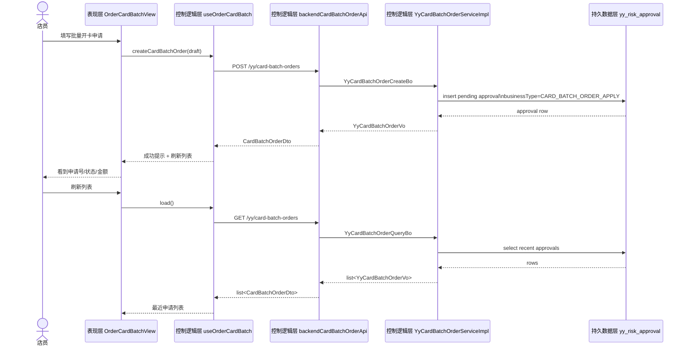

# order-card-batch-scaffold-flow-20260625

## 用户路径

- 店员从 `订单 / 批量开卡` 进入 owner 页。
- 输入门店、卡项、数量、金额和审批原因。
- 系统创建审批申请并回显最近申请列表。
- 审批通过前不生成真实订单，不发放权益。

## Mermaid 数据流

## 失败路径

- 参数校验失败：页面显示错误，不创建审批单。
- 后端异常：页面保留草稿并展示失败信息。
- 审批未通过：列表保留申请记录和驳回结果摘要。

## 数据边界

- 订单账本仍是 `yy_order`，本包不写入。
- 权益、储值、支付、卡实例均不在本包内创建。
- 批量开卡只是审批脚手架，不代表生产闭环完成。
