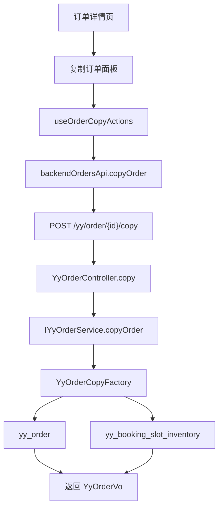

# 复制订单流程

```mermaid
flowchart TD
  A[订单详情页] --> B[复制订单面板]
  B --> C[useOrderCopyActions]
  C --> D[backendOrdersApi.copyOrder]
  D --> E["POST /yy/order/{id}/copy"]
  E --> F[YyOrderController.copy]
  F --> G[IYyOrderService.copyOrder]
  G --> H[YyOrderCopyFactory]
  H --> I[yy_order]
  H --> J["yy_booking_slot_inventory"]
  I --> K[返回 YyOrderVo]
  J --> K
```

## 说明
- 表现层负责收集复制模式、档期和备注。
- 控制层负责生成新单并重建库存校验。
- 数据层只写新 `yy_order`，并按需确认 `yy_booking_slot_inventory`。
