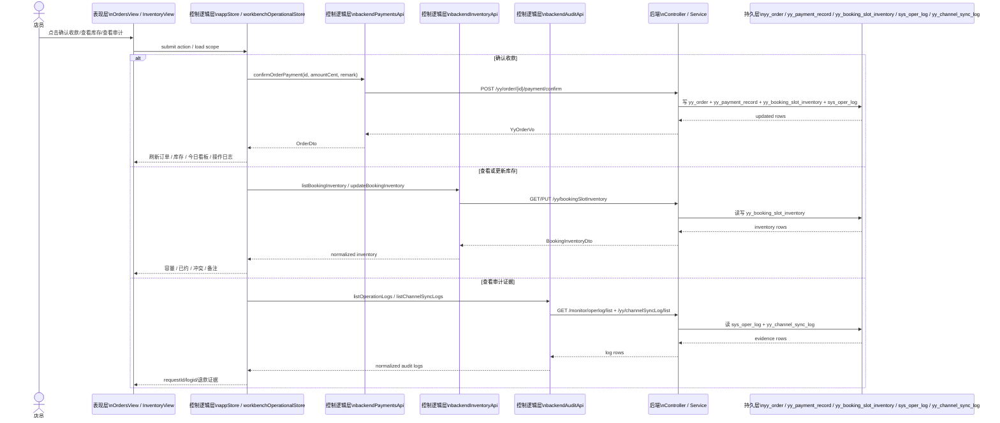

# 订单 / 支付 / 排期库存 / 审计 Phase 1 数据流

> owner: full-product-closed-loop-phase1
> canonical_for: Phase 1 前端 owner 收口与真实账本只读/写入边界
> upstream: `docs/flows/full-product-closed-loop-flow.md`, `docs/flows/flow-template.md`
> downstream: 支付确认、库存刷新、审计证据和退款只读呈现

## 用户路径

1. 店员在 `预约订单` 打开订单详情。
2. 若订单满足人工确认收款条件，则在详情抽屉执行“确认收款”。
3. 收款成功后，订单、库存、今日预约、统计卡片与操作日志一起刷新。
4. 店员在 `时段库存` 查看某天某店真实容量与冲突，必要时更新容量备注。
5. 管理端在订单详情时间线中查看操作审计和渠道日志，确认支付、退款和渠道回调证据。

## Mermaid 数据流

## 执行步骤

1. 新增 Phase 1 契约与流程文档，固定允许改动范围和验证口径。
2. 在 `shared/api` 新增 `payments / inventory / audit` 三个 slice，并从旧 slice 中迁出对应方法。
3. 保留 `backendApi` 的兼容聚合外观，避免现有页面与 store 大改。
4. 为 Phase 1 新增共享 query/type 契约，至少覆盖支付记录类型、库存查询、审计查询。
5. 更新 contract tests 与地图，并执行目标验证。
