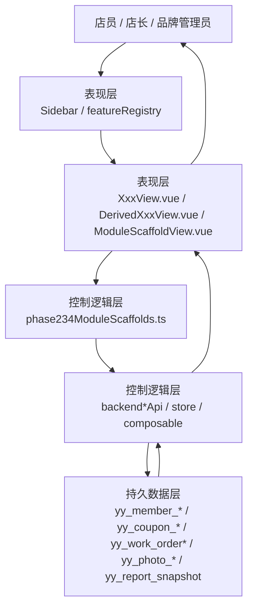
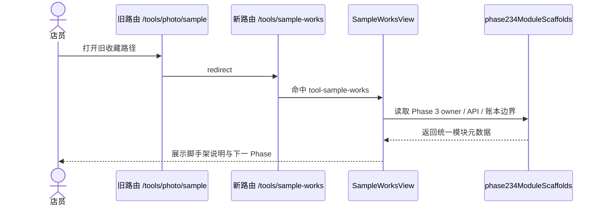
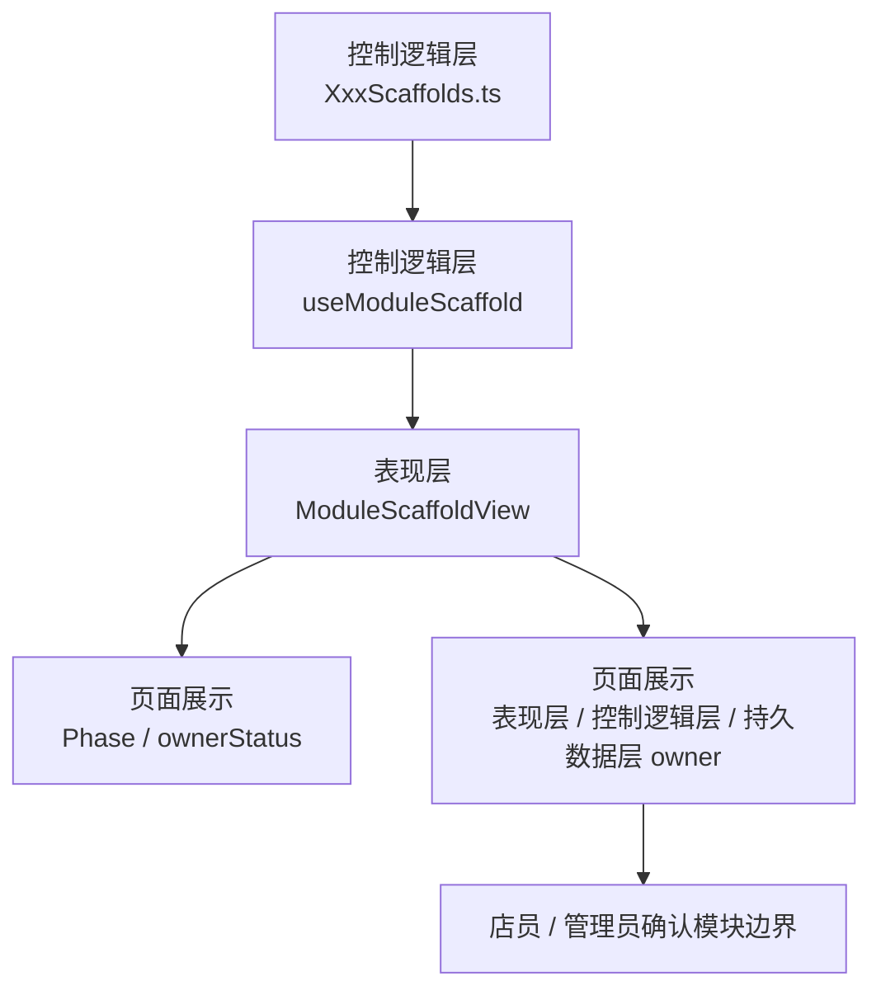
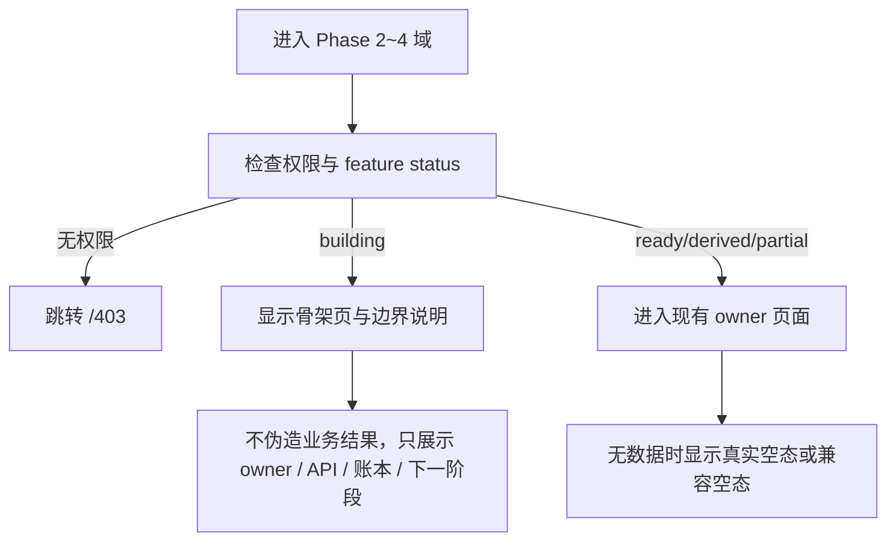

# 全产品完美复刻 Phase 2~4 域脚手架数据流

> owner: full-product-closed-loop-phase234-scaffold
> canonical_for: Phase 2~4 域注册、导航接线和兼容路径
> upstream: `docs/flows/full-product-closed-loop-flow.md`, `docs/flows/flow-template.md`
> downstream: Phase 2~4 真功能任务包

## 用户路径

1. 工作台用户从侧边栏进入 Phase 2 真功能域或 Phase 3/4 脚手架域。
2. 路由统一从 `featureRegistry.ts` 读取分组、状态、权限和目标组件。
3. 页面 owner 再从 `phase234ModuleScaffolds.ts` 查到模块阶段、控制层 owner 和真实账本边界。

## 三层总图

## 样片入口兼容流

## 运行态三层 owner 展示

## 失败路径

