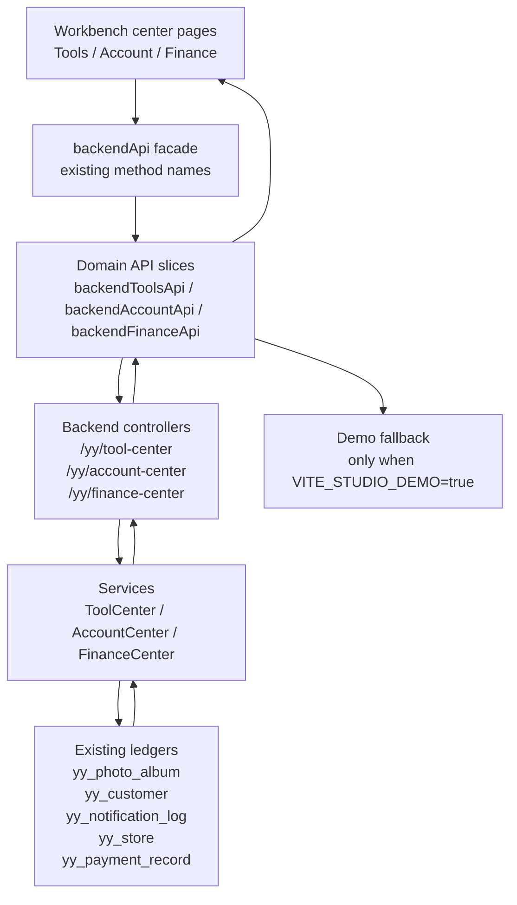

# Phase 3 Center API Owner Flow

> owner: full-product-phase3-center-api-owner
> date: 2026-06-24

## Failure Path

- API mode surfaces backend errors instead of silently returning fake data.
- Demo mode may return scaffold fallback data for local preview.
- Write-like actions in this package are response-level contract placeholders and do not persist funds, profile, brand, or album publishing state.

## Acceptance

- Routes continue to enter through existing navigation.
- Frontend uses `apiRequest` for account, finance, and tool center owner slices.
- Backend exposes controller/service boundaries without touching external channel write paths.
- Contract tests verify facade compatibility and endpoint strings without duplicating page-level tests.
