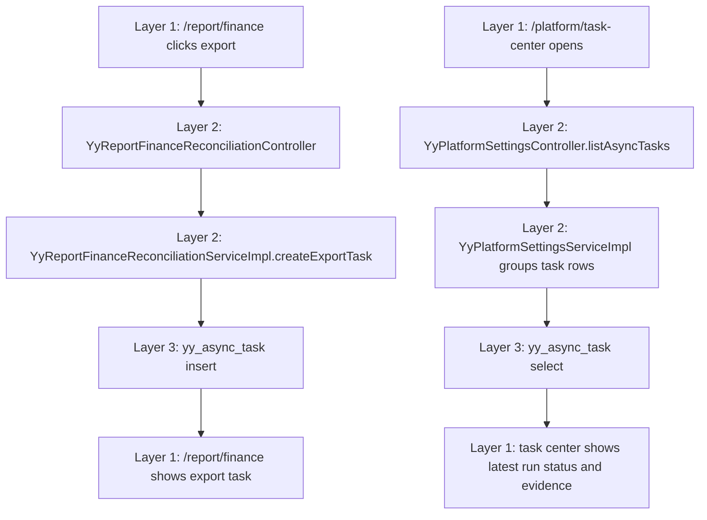

# Platform Async Task Ledger Flow - 2026-06-26

## Success Path

1. Staff opens `/report/finance`.
2. Staff clicks export.
3. Backend creates a `REPORT_FINANCE_RECONCILIATION_EXPORT` task and persists metadata into `yy_async_task`.
4. Report page receives `taskId/status/downloadUrl/expireTime/auditNote`.
5. Staff opens `/platform/task-center`.
6. Task center reads `yy_async_task`, groups by task type, and displays latest status with `yy_async_task` evidence.

## Failure and Boundary Path

- If no persisted tasks exist, task center keeps the previous scaffold rows so the platform page remains readable.
- Current package does not generate a real export file, upload to object storage, retry failed tasks, or clean expired downloads.
- Download URL is a reserved entry and must not be treated as production file delivery until object storage and permission checks are implemented.
