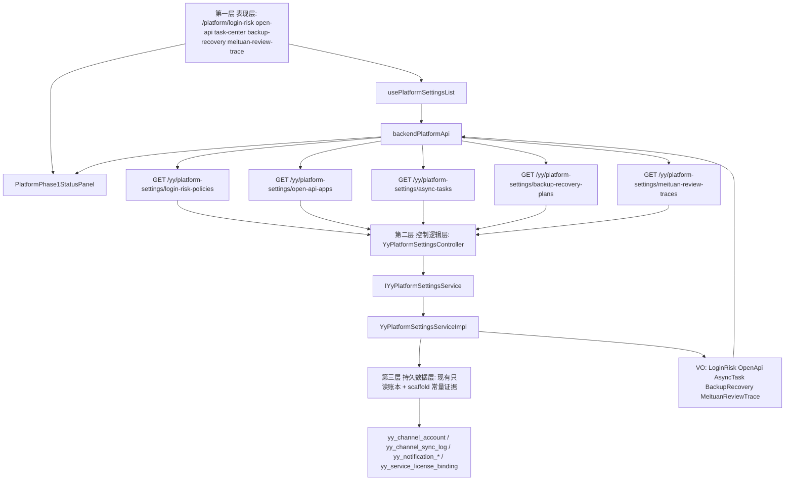

# 平台与企业级能力三层数据流

更新时间：2026-06-25

## 用户路径

平台运营或管理员进入工作台 `平台设置` 分组后，可分别点击 `登录风控`、`开放 API`、`任务中心`、`备份恢复`、`美团差评溯源`。成功时看到脚手架状态、证据和下一步动作；失败时看到只读错误态并可重试。

## Mermaid 数据流

## 失败路径

- 前端接口失败：对应页面展示 `error` 状态并保留 `Reload`。
- 缺真实账本：后端返回 `scaffold`，并在 `evidence`/`nextActions` 里明确缺口。
- 缺权限：路由按 `featureRegistry` 使用既有权限码拦截，不新增未验证权限码。

## 验收边界

- 本任务只补平台 owner 脚手架，不代表企业级真实闭环完成。
- 本任务不新增表、不写库、不调用真实第三方写接口。
- 后续验收应单独验证：5 个路由可打开、5 个只读接口返回稳定 DTO、产品清单和地图能追溯到 owner 文件。
