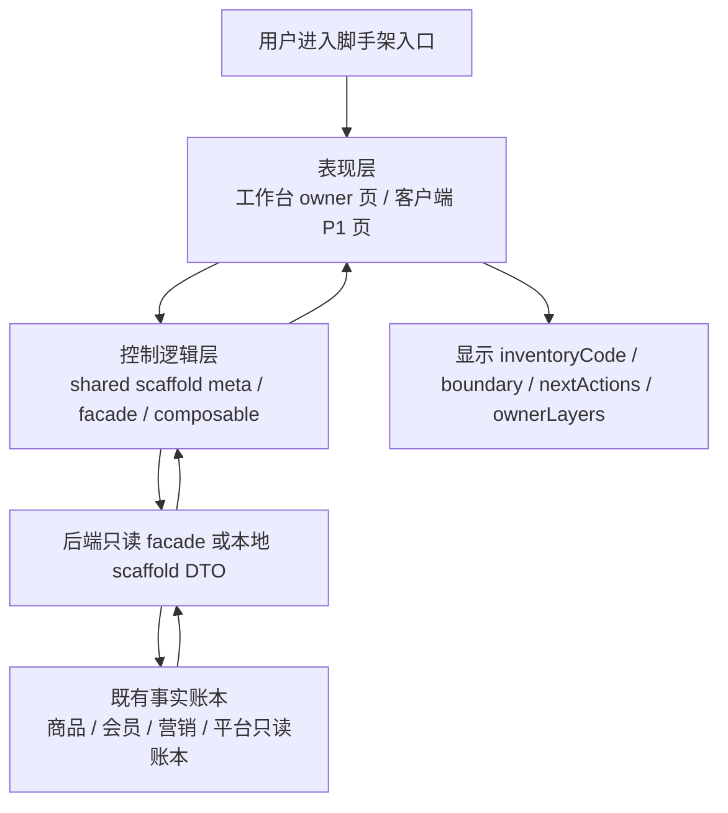
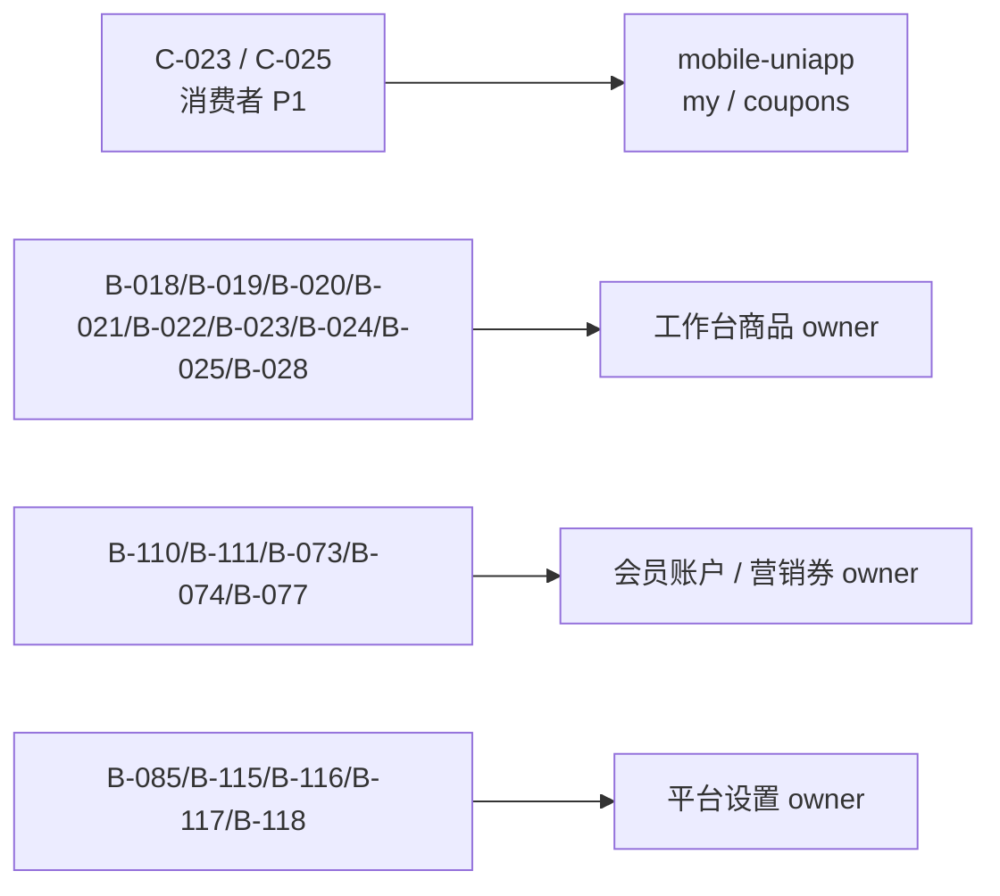

# 产品功能清单 84 - 21 项脚手架验收数据流

## 用户路径

1. 店员或验收人从工作台、客户端进入 21 个对应入口。
2. 页面展示 canonical owner、功能编号、边界说明和下一步动作。
3. 页面只读取现有 scaffold/read-only facade。
4. 缺真实账本时显示 `scaffold/building/not_connected`，不伪装为 `ready`。

## Mermaid 数据流

## 21 项归并流向

## 输出要求

- 页面必须展示：
  - `inventoryCodes`
  - `acceptanceLabel`
  - `boundaryNotes`
  - `nextActions`
  - `ownerLayers`
- 文档必须同步：
  - `docs/yiyue/function_map.md`
  - `docs/yiyue/code_map.md`
  - `docs/yiyue/api_map.md`
  - `docs/yiyue/optimization_map.md`
