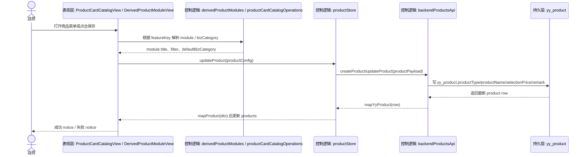
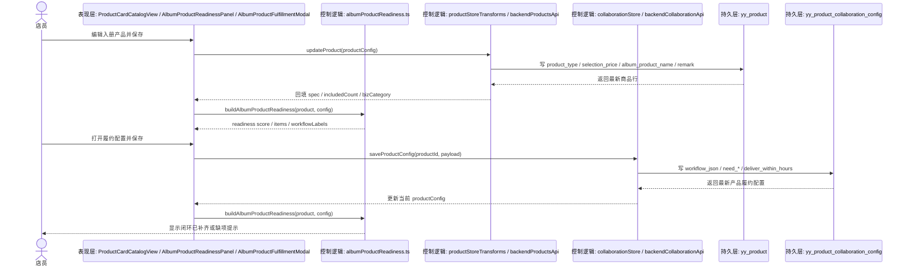
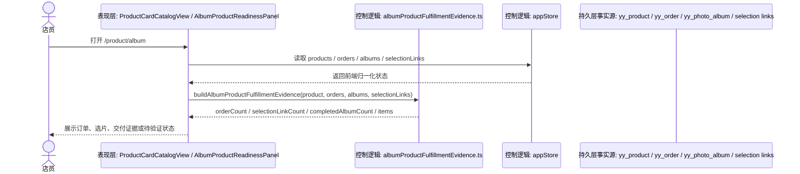
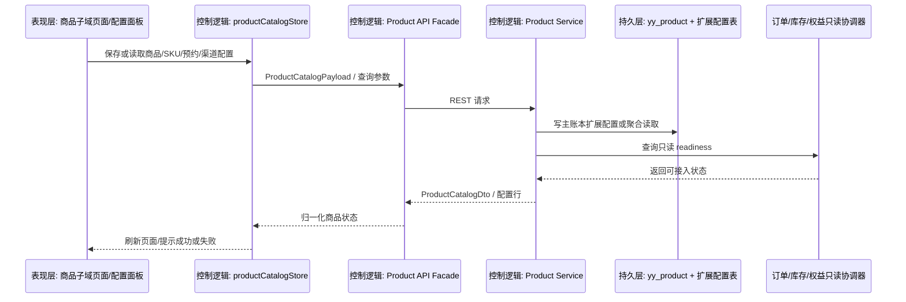

# 商品模块数据流（2026-06-24）

## 用户路径

- 店员从左侧商品菜单进入：
  - `/product/addon`
  - `/product/group`
  - `/product/print`
  - `/product/album`
  - `/product/card-catalog`
- `addon/group/print` 使用派生只读/轻操作视图。
- `album/card-catalog` 使用可编辑目录 owner。

## Mermaid 数据流

## Phase1 入册闭环补齐

### 用户路径

1. 店员进入 `/product/album`。
2. 在商品卡片列表中新增或编辑入册产品，填写规格、入册张数和加片单价。
3. 页面通过 `AlbumProductReadinessPanel` 直接展示三项闭环状态：
   - 规格 / 入册张数
   - 选片 / 加修联动
   - 订单履约
4. 点击 `履约配置` 打开 `AlbumProductFulfillmentModal`，保存摄影、修图、选片审核、取件和时效配置。
5. 保存成功后：
   - 商品元数据继续写回 `yy_product`
   - 履约配置单独写回 `yy_product_collaboration_config`

### Mermaid 数据流

### 接口 / 对象契约

- 商品元数据 codec：
  - 文件：`studio-workbench/src/shared/products/albumProductMetadata.ts`
  - 写入口径：`albumProductName = <规格>｜<张数>张`
  - 读入口径：兼容 `轻奢相册｜12张` 和历史自由文本 `精修入册10张`
- 履约配置 payload：
  - 文件：`studio-workbench/src/shared/api/backendTypesCollaboration.ts`
  - 关键字段：
    - `productId`
    - `workflowJson`
    - `needMakeup / needPhotography / needRetouch / needReview / needSelectionReview / needPickup`
    - `makeupCount`
    - `deliverWithinHours`
- 履约配置接口：
  - `GET /yy/collaboration/product-config/list`
  - `PUT /yy/collaboration/product-config/{productId}`

## Phase2 入册履约证据回读

### 用户路径

1. 店员进入 `/product/album`。
2. 商品卡片继续展示规格、选片和履约配置闭环。
3. 同一张卡片展示履约证据：
   - 订单关联
   - 选片证据
   - 交付证据
4. 没有真实订单时显示 `暂无订单履约证据`，不伪造已完成状态。

### Mermaid 数据流

### 接口 / 对象契约

- 不新增后端接口。
- 不新增持久表。
- 前端只读对象：
  - `ProductConfig`
  - `BookingOrder`
  - `Album`
  - `SelectionLink`
- 订单匹配优先级：
  - `BookingOrder.productBackendId`
  - `BookingOrder.externalProductId`
  - `BookingOrder.externalSkuId`

## 失败路径

- 路由未注册：菜单无法进入对应模块。
- `bizCategory` 未写回：后端会把商品错误落成 `spec` 或默认 `SERVICE`。
- `bizCategory` 未回填：派生视图无法稳定识别 `ALBUM / GROUP_BUY`。
- 后端保存失败：页面只提示错误，不改本地成功态。
- `album_product_name` 未按 codec 写入：规格和入册张数无法稳定回读。
- 履约配置未保存：入册商品只停留在商品层，订单无法根据真实协作节点履约。
- 没有订单、相册或选片记录：履约证据保持待验证，不提升为已闭环。

## 执行结果

1. 路由层新增 `product-album -> /product/album -> product-card-catalog`。
2. 分类层统一 `GROUP_BUY` 写入口径，并兼容读取 `GROUP`。
3. `ALBUM` 正式进入商品目录 owner，可新增、编辑、上下架、按门店过滤。
4. DTO/API/store 三层完成 `bizCategory` 透传。
5. `album_product_name` 正式承载入册规格/张数 codec，前后端可稳定回读。
6. 订单履约配置复用 `yy_product_collaboration_config`，不新增第二套入册履约表。
7. 入册商品卡片可回读订单、选片、交付三类履约证据。

## 2026-06-25 全链路脚手架数据流

### 分层路径

- 表现层：
  - `studio-workbench/src/features/products/catalog/ProductCatalogModuleView.vue`
  - `studio-workbench/src/features/products/sku/ProductSkuModuleView.vue`
  - `studio-workbench/src/features/products/category/ProductCategoryModuleView.vue`
  - `studio-workbench/src/features/products/relation/ProductRelationModuleView.vue`
  - `studio-workbench/src/features/products/booking-rules/ProductBookingRulesModuleView.vue`
  - `studio-workbench/src/features/products/channel/ProductChannelModuleView.vue`
  - `studio-workbench/src/features/products/cards/ProductCardsModuleView.vue`
- 控制逻辑层：
  - `studio-workbench/src/shared/stores/productCatalogStore.ts`
  - `studio-workbench/src/shared/stores/productCatalogTransforms.ts`
  - `studio-workbench/src/shared/api/backendProductCatalogApi.ts`
  - `studio-workbench/src/shared/api/backendProductSkuApi.ts`
  - `studio-workbench/src/shared/api/backendProductCategoryApi.ts`
  - `studio-workbench/src/shared/api/backendProductRelationApi.ts`
  - `studio-workbench/src/shared/api/backendProductBookingRuleApi.ts`
  - `studio-workbench/src/shared/api/backendProductChannelConfigApi.ts`
  - `backend/ruoyi-modules/ruoyi-yy/src/main/java/org/dromara/yy/service/impl/YyProductCatalogServiceImpl.java`
- 持久层：
  - `yy_product`
  - `yy_product_category`
  - `yy_product_sku`
  - `yy_product_display_config`
  - `yy_product_relation`
  - `yy_product_booking_rule`
  - `yy_product_channel_config`
  - `yy_product_fulfillment_rule`

### 失败路径

- 扩展配置保存失败：前端保留错误态，不伪造成功。
- readiness 返回未绑定：只展示待接入状态，不触发真实支付、库存、权益动作。
- 渠道配置保存：仅保存本地映射补充配置，不调用抖音/美团真实写接口。
