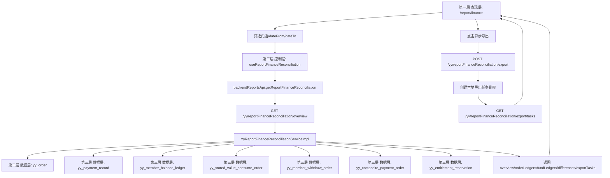

# report-finance 财务对账报表三层流程

日期：2026-06-26

## 失败路径

- 日期格式错误：后端返回 `ServiceException`，前端展示 `report-finance-error`。
- 无权限：`yy:report:list` 或 `yy:report:export` 校验失败，由统一请求层处理。
- 当前范围无数据：页面展示真实空态，不伪造金额。

## 不做事项

- 不写入真实支付、退款、提现外部接口。
- 不新增第二套财务主账本。
- 不在本包落对象存储文件、跨实例队列和下载过期清理任务。
