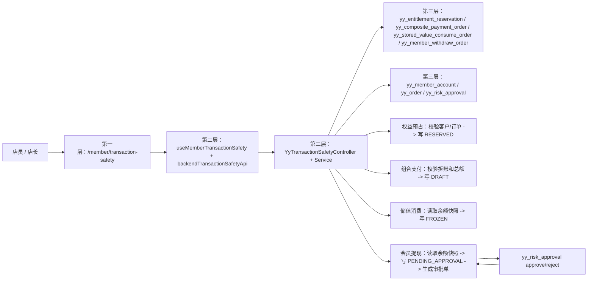

# 交易安全脚手架 Mermaid 数据流

```mermaid
flowchart LR
  User["店员 / 店长"] --> UI["第一层：/member/transaction-safety"]
  UI --> FE["第二层：useMemberTransactionSafety + backendTransactionSafetyApi"]
  FE --> BE["第二层：YyTransactionSafetyController + Service"]
  BE --> Data["第三层：yy_entitlement_reservation / yy_composite_payment_order / yy_stored_value_consume_order / yy_member_withdraw_order"]
  BE --> Ledger["第三层：yy_member_account / yy_order / yy_risk_approval"]

  BE --> Reserve["权益预占：校验客户/订单 -> 写 RESERVED"]
  BE --> Split["组合支付：校验拆账和总额 -> 写 DRAFT"]
  BE --> Consume["储值消费：读取余额快照 -> 写 FROZEN"]
  BE --> Withdraw["会员提现：读取余额快照 -> 写 PENDING_APPROVAL -> 生成审批单"]

  Withdraw --> Approval["yy_risk_approval approve/reject"]
  Approval --> Withdraw
```
