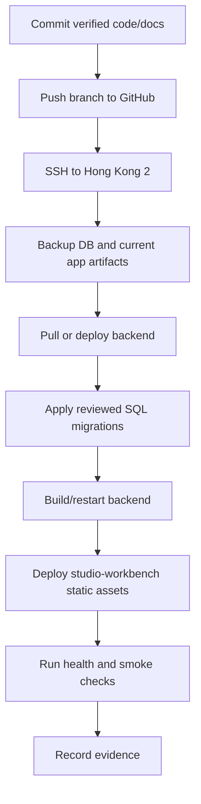

# JianYue Booking Deploy Rollback Map 2026-06-17

## Conclusion

Deploy to Hong Kong 2 only after local build/tests and data migration review. Rollback must protect `yy_order` and `yy_booking_slot_inventory` first.

## Environments

| Environment | Purpose | Notes |
| --- | --- | --- |
| Local repo | Development and tests | `D:\OtherProject\CameraApp\yingyue-cloud-repo` |
| Local docs/cache | Maps, scripts, credentials references | `docs\yiyue`; do not commit secrets |
| GitHub branch | Remote source control | `yingyue-closed-loop-optimization-20260603` |
| Hong Kong 2 | Production/staging server currently used | SSH details are local under `C:\Users\Administrator\Desktop\服务器` |
| Public studio | Workbench URL | `https://studio.evanshine.me` |
| Public API | Backend URL | `https://api.evanshine.me` |

## Pre-Deploy Checklist

| Check | Command |
| --- | --- |
| Git status | `git status --short --branch` |
| Frontend tests | `npm --prefix studio-workbench run test` |
| Frontend build | `npm --prefix studio-workbench run build` |
| Backend compile | `mvn -pl backend/ruoyi-modules/ruoyi-yy -DskipTests compile` |
| SQL review | inspect migration scripts before applying |
| Secret scan | `rg -n "APPSecret|client_secret|password|密码|token" docs docs\yiyue` and manually ignore only documented secret-file path mentions |
| Evidence folder | write acceptance evidence under `docs/evidence` |

## Deployment Order



## Database Backup

Before any migration touching booking data:

```powershell
.\tools\get-yingyue-booking-chain-snapshot.ps1 -Mode SshDocker -SshHost 103.24.216.8 -SshPasswordFile C:\Users\Administrator\Desktop\服务器\香港2.txt -Date 2026-06-17 -LookbackDays 30
```

Also run a server-side `pg_dump` using the current deployment's known database container/config. Store backup filename and time in evidence.

## Smoke Checks After Deploy

| Check | Expected |
| --- | --- |
| `https://studio.evanshine.me/login` | Login page loads and accepts configured test/staff account. |
| `/dashboard/today` | Shows dashboard and today appointment summary. |
| `/schedule` | Shows `上午 / 下午 / 晚上` slot board. |
| `/order/appointment` | Shows JianYue-like status tabs and filters. |
| Staff create modal | Opens from explicit new-order entry. |
| Sync health | Douyin sync status page/API returns recent log or clear permission issue. |

## Rollback Triggers

| Trigger | Rollback action |
| --- | --- |
| Backend fails to start | Restore previous backend artifact/config; do not apply additional SQL. |
| Frontend blank page | Restore previous static assets or redeploy previous build. |
| New migration corrupts slot/order counts | Restore DB from pre-deploy backup after user approval. |
| Login broken | Revert auth/config change first; keep booking data untouched. |
| Douyin sync writes wrong store mapping | Stop sync, restore affected rows from backup or corrective SQL after diff review. |

## Rollback Rules

- Do not use destructive Git commands on the shared local worktree.
- Do not overwrite production DB without confirming backup and affected tables.
- Prefer forward corrective migration for small mapping/UI issues.
- Use full DB restore only for data corruption that cannot be corrected safely.

## Evidence Standard

Record:

| Item | Example |
| --- | --- |
| Commit | `git rev-parse HEAD` |
| Build/test commands | command and pass/fail |
| Migration scripts | exact filenames |
| Backup file | exact server path |
| Smoke URLs | pages checked |
| Data snapshot | today slots, today orders, one-month Douyin missing-slot count |
| Remaining risks | platform ability gaps, historical data limits |
