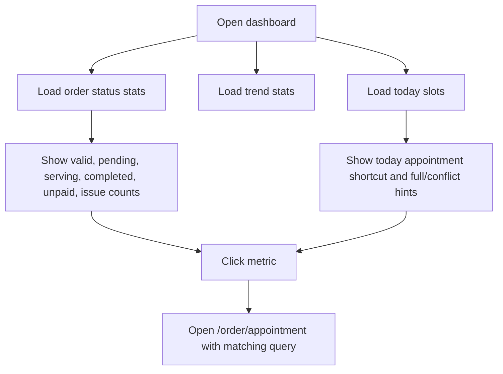
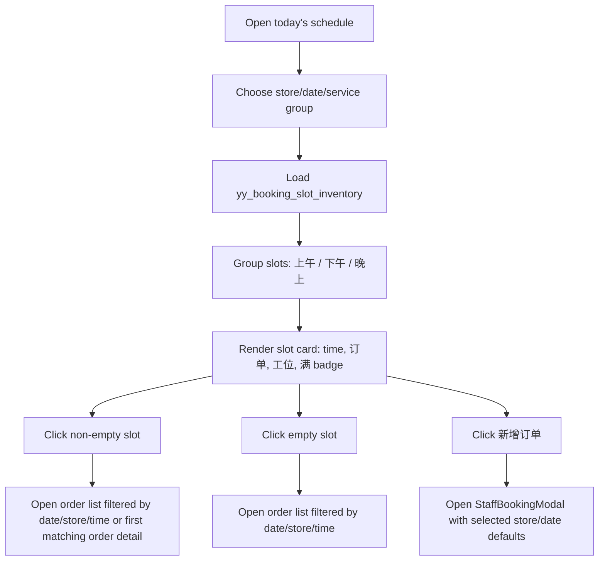
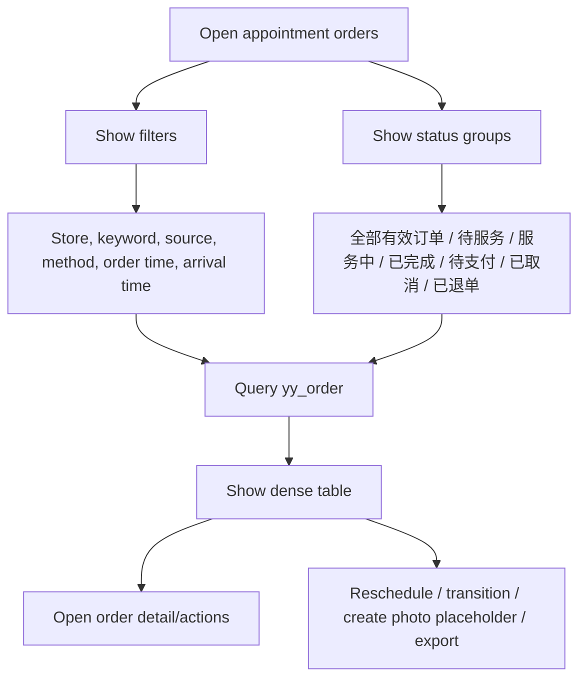
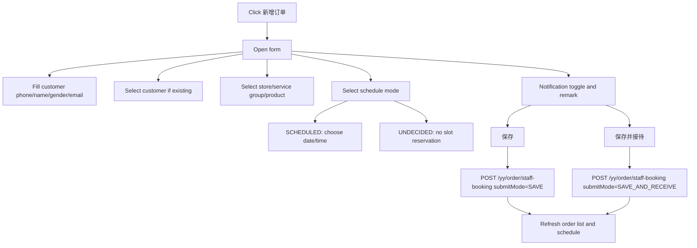
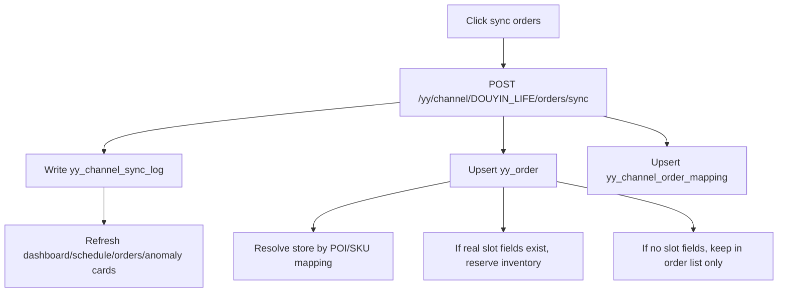

# JianYue Booking Interaction Flow Map 2026-06-17

## Conclusion

The target interaction model is JianYue-like but data-backed by YingYue ledgers:

```text
首页经营概况 -> 今日预约 -> 时段格 -> 预约订单列表/详情 -> 新增服务订单 -> 保存/保存并接待
```

Slots are inspection/filter entries. Order creation must happen through explicit `新增订单` / `新增服务订单` actions.

## Main Navigation

| Entry | Route | Primary component | Purpose |
| --- | --- | --- | --- |
| 首页 | `/` or `/dashboard/today` | `DashboardView.vue` | Overview of business, today workload, exceptions, shortcuts |
| 今日预约 | `/schedule` or current schedule route | `ScheduleView.vue` | Morning/afternoon/evening capacity board |
| 预约订单 | `/order/appointment` | `OrdersView.vue` | Search, filter, operate appointment orders |
| 新增服务订单 | modal/page entry from schedule or order page | `StaffBookingModal.vue` | Staff manual create |

## Flow 1: 首页经营概况



Rules:

- Default dashboard order window should prioritize today and recent one-month Douyin Life data.
- Metrics must deep link to a filtered order list when possible.
- Missing-slot Douyin historical orders should appear as data-quality/anomaly hints, not as fake slots.

## Flow 2: 今日预约 Board



Rules:

- The board is not a horizontal drag strip. Mouse wheel must scroll the page vertically; horizontal overflow should be avoided for desktop.
- Slot cards use stable width grid and wrap rows.
- `上午 / 下午 / 晚上` are section headers, not a scrollbar.
- Full slot badge `满` appears when capacity is exhausted.
- Empty-slot click filters/inspects; explicit button creates.

## Flow 3: 预约订单 List



Rules:

- Default view should not load every historical order. Use today or recent one-month window for platform-heavy views.
- `全部有效订单` excludes cancelled/refunded/deleted rows.
- A query from a slot must preserve date/store/time filters.
- Order row actions must respect permissions and status transitions.

## Flow 4: 新增服务订单



Required fields:

| Section | Fields |
| --- | --- |
| Customer | phone, name, gender, email, customer association |
| Order | store, service group, product |
| Schedule | schedule mode, date, start, end, workstation when used |
| Operations | notification toggle, remark |
| Footer | `返回`, `保存`, `保存并接待` |

## Flow 5: 同步订单



Rules:

- Webhook/SPI is preferred for new real-time orders.
- Active sync is a compensation and backfill path.
- Unknown POI/SKU becomes `NEED_MAPPING`; do not silently assign a store.

## Flow 6: 异常处理

```text
NEED_MAPPING -> open mapping page -> map POI/SKU -> backfill -> refresh order
CONFLICT -> open slot/order -> staff reschedule or accept over-capacity with remark
Missing slot -> order list/anomaly only -> wait for real platform payload or manual staff schedule
Sync failed -> sync log detail -> rerun from server/HK2 after checking IP/ability/logid
```

## UX Non-Negotiables

- No important operation hidden behind unclear cards.
- No fake data in schedule to make the UI look full.
- No horizontal wheel trap for normal desktop workbench pages.
- Staff manual entry must be discoverable from both schedule and order list.
- Every dashboard number should have a traceable query or documented derivation.
