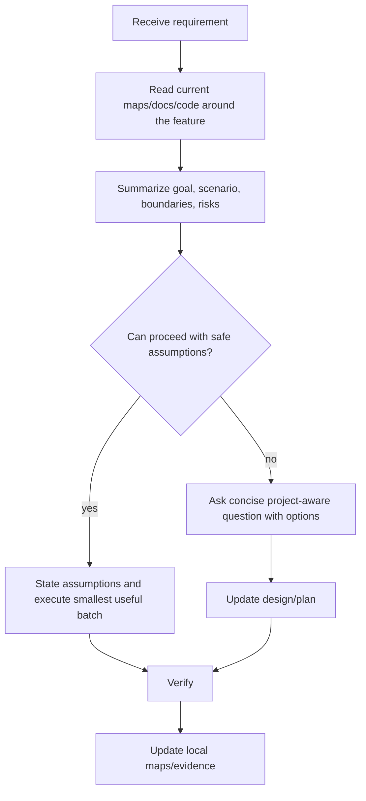

# JianYue Booking Requirement Intake Map 2026-06-17

## Conclusion

For this project, vague requirements must be converted into a project-aware plan before implementation. The agent should inspect current code/docs first, then ask only questions that cannot be answered from local context.

## Required Intake Flow



## What To Inspect First

| Requirement mentions | Inspect |
| --- | --- |
| 首页/经营概况 | `DashboardView.vue`, `appStore.ts`, status stats endpoints |
| 今日预约/上午下午晚上/工位 | `ScheduleView.vue`, `JianyueSlotGrid.vue`, `scheduleOperations.ts`, `yy_booking_slot_inventory` |
| 预约订单/状态筛选 | `OrdersView.vue`, `orderOperations.ts`, `yy_order` |
| 店员录入/新增订单 | `StaffBookingModal.vue`, `YyStaffBookingCreateBo.java`, `YyOrderServiceImpl.java` |
| 抖音来客/同步/Webhook | local maps under `docs\yiyue`, `DouyinLifeChannelAdapter.java` |
| 部署/香港2 | deploy map, server folder, evidence runbooks |

## Summary Template

```text
我先按当前项目理解确认：
- 目标：
- 真实场景：
- 已有能力：
- 不能做的假设：
- 风险：
- 我准备先做：
```

## Question Rules

- Ask only after reading current project context.
- Prefer one concise question when blocked.
- Use options when the user has a product choice.
- Do not ask for data that can be discovered from code, existing maps, server scripts, or non-secret APIs.
- Do not ask the user to re-provide secrets already stored locally; report only presence/validation, not values.

## Safe Assumptions In This Project

| Area | Safe assumption |
| --- | --- |
| Booking ledger | `yy_order` remains the only order ledger. |
| Slot capacity | `yy_booking_slot_inventory` remains the capacity ledger. |
| Douyin Life | Historical rows without slot payload are not schedule-board rows. |
| UI reference | JianYue is the operational reference for booking pages. |
| Store scope | Real store ids and employee scopes must be respected. |
| Deployment | GitHub push and Hong Kong 2 deploy require verification first. |

## Escalation Questions Worth Asking

| Situation | Question |
| --- | --- |
| Two valid UX policies conflict | Ask which policy wins, with screenshots/options. |
| Real platform data missing | Ask whether to wait for new payloads, import from JianYue, or use staff manual scheduling. |
| Data migration may rewrite production | Ask for explicit approval after showing backup and row counts. |
| Secret/credential missing | Ask user to provide or confirm local file path, never request public chat paste unless they insist. |

## Bad Questions To Avoid

| Bad question | Better action |
| --- | --- |
| “项目在哪里？” | Use repo/map path already documented. |
| “接口有哪些？” | Read API maps and controllers first. |
| “要不要用 yy_order？” | It is already decided as the single ledger. |
| “历史抖音订单要不要生成时段？” | Do not fabricate; only ask if user wants manual scheduling/import strategy. |
| “香港2服务器是什么？” | Read deploy/server maps and local server folder first. |
