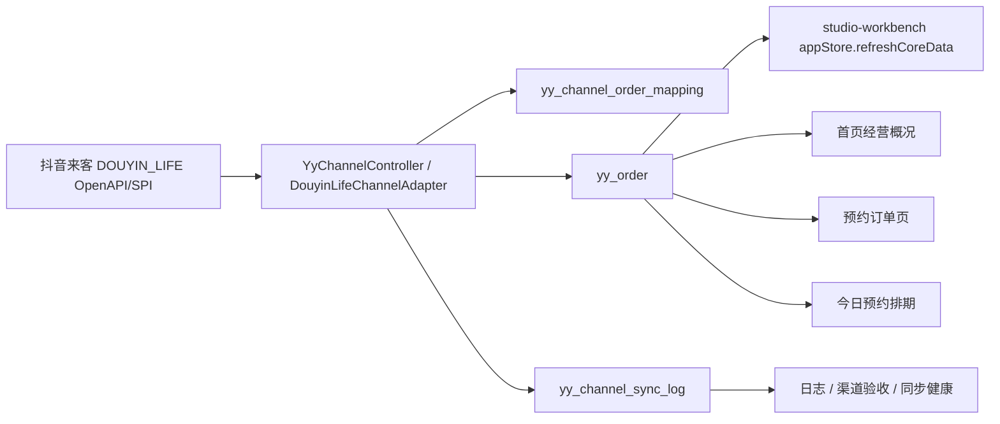

# Studio Order Dashboard Sync Implementation Plan

> **For agentic workers:** REQUIRED SUB-SKILL: Use superpowers:subagent-driven-development (recommended) or superpowers:executing-plans to implement this plan task-by-task. Steps use checkbox (`- [ ]`) syntax for tracking.

**Goal:** 完成门店工作台的预约订单、首页经营概况、今日预约排期、抖音来客订单同步和简约网式订单状态分组收口。

**Architecture:** `yy_order` 继续作为唯一订单/预约主账本，抖音来客通过 `DOUYIN_LIFE` 同步到本地账本，工作台所有页面读取本地账本和派生聚合。前端只做查询、状态流转、改期、导出和同步触发，不直接绕过后端访问抖音 OpenAPI。

**Tech Stack:** Vue 3, TypeScript, Vite, Vue Router, Tailwind CSS, Vitest, Spring Boot, RuoYi-Vue-Plus, PostgreSQL, Redis, Aliyun OSS, Douyin Life OpenAPI/SPI.

---

> owner: studio-order-dashboard-sync-plan-20260616
> canonical_for: 预约订单、首页经营概况、今日预约、同步订单、订单状态分组的完成计划和交接地图
> upstream: docs/studio-workbench-complete-delivery-plan-20260615.md, docs/studio-workbench-api-route-map.md, docs\yiyue\code_map.md, docs\yiyue\api_map.md
> downstream: docs/studio-workbench-complete-delivery-index-20260615.md, docs\yiyue\studio-workbench-order-dashboard-sync-plan-20260616.md

## 当前结论

本轮检查到，用户提出的主功能不是从零开始，当前仓库已经具备核心实现：

| 模块 | 当前状态 | 关键证据 |
| --- | --- | --- |
| 预约订单页 | 已有真实列表、详情、状态流转、改期、导出、同步订单按钮和简约网式状态分组 | `studio-workbench/src/features/orders/OrdersView.vue` |
| 同步订单 | 已接 `appStore.syncDouyinLifeOrdersAndRefresh()`，会调用后端 `POST /yy/channel/DOUYIN_LIFE/orders/sync` 后刷新订单、首页、排期、同步健康和日志 | `studio-workbench/src/shared/stores/appStore.ts`, `studio-workbench/src/shared/api/backend.ts` |
| 首页经营概况 | 已有经营概况、服务订单状态、产品排行、渠道订单汇总、预约趋势和深链承接 | `studio-workbench/src/features/dashboard/DashboardView.vue` |
| 今日预约 | 已有门店排期页、今日预约排期承接、预约时段工位、订单/库存/入口跳转 | `studio-workbench/src/features/schedule/ScheduleView.vue` |
| 后端同步能力 | 已有渠道订单查询、手动同步、自动同步状态和同步健康摘要接口 | `backend/ruoyi-modules/ruoyi-yy/src/main/java/org/dromara/yy/controller/YyChannelController.java`, `YyDouyinLifeAutoSyncService.java` |
| 真实门店口径 | 不是限制四个店铺，当前是抖音来客里四个可用店铺；系统按 `/yy/store/list` 和平台可用授权读取 | `docs/evidence/studio-workbench-store-min-count-deploy-20260616.md` |

2026-06-16 代码侧补充：简约网式状态分组已经抽到 `orderOperations.ts` 的 `buildOrderStatusGroupCounts()` / `matchesOrderStatusGroup()`，`OrdersView.vue` 和 `DashboardView.vue` 已共用同一套规则；目标测试和 `npm run build` 已通过。

2026-06-16 10:46 补充：API 契约、前端目标测试、生产构建、香港2静态部署、公开路由探针和登录页浏览器 smoke 已完成。登录页现为右侧面板、账号密码登录文案、无验证码输入框；构建产物已使用 `VITE_STUDIO_RELEASE_ID` 生成 `/assets/studio-20260616-1044/` 目录，避免浏览器继续命中旧懒加载 chunk。剩余不是“页面没骨架”，而是生产真实员工 session 下的数据交互 smoke、GitHub 提交分组和抖音来客平台 logid 验收。

剩余工作集中在三类：统一状态口径、真实 API/浏览器验收证据、部署证据。不要再新建第二套预约订单表，也不要把 `DOUYIN_LIFE` 和 `DOUYIN_MINI_APP` 合并。

## 业务口径

### 订单状态分组

| 页面标签 | 规则 | 导出/筛选映射 |
| --- | --- | --- |
| 全部有效订单 | 排除 `已取消`、`已退单`、支付 `已退款` | 前端分组，不直接扩展后端状态 |
| 待服务 | `status = 待确认` | 后端状态 `PENDING` |
| 服务中 | `status in 已确认, 拍摄中` | 后端状态 `CONFIRMED` / `SERVING`；多状态导出目前拦截 |
| 已完成 | `status in 选片中, 已完成` 且非退款/取消 | 后端状态 `COMPLETED` |
| 待支付 | 有效订单且 `payment = 待支付` | 后端支付状态 `UNPAID` |
| 已取消 | `status = 已取消` | 后端状态 `CANCELLED` |
| 已退单 | `status = 已退单` 或 `payment = 已退款`，但不重复计入已取消 | 后端状态 `REFUNDED` 或支付状态 `REFUNDED` |

### 数据流



## 接口地图

| 能力 | 前端入口 | Store/API | 后端接口 |
| --- | --- | --- | --- |
| 拉取本地订单 | `OrdersView.vue`, `DashboardView.vue`, `ScheduleView.vue` | `appStore.refreshCoreData()`, `backendApi.listOrders()` | `GET /yy/order/list` |
| 订单状态流转 | `OrdersView.vue` 详情动作 | `appStore.updateOrderStatus()`, `backendApi.updateOrderStatus()` | `POST /yy/order/{id}/transition` |
| 订单改期 | `OrdersView.vue` 改期表单 | `appStore.rescheduleOrder()`, `backendApi.rescheduleOrder()` | `POST /yy/order/{id}/reschedule` |
| 导出订单 | `OrdersView.vue` 导出按钮 | `appStore.exportOrders()`, `backendApi.exportOrders()` | `POST /yy/order/export` |
| 手动同步抖音来客订单 | `OrdersView.vue` 同步订单按钮 | `appStore.syncDouyinLifeOrdersAndRefresh()`, `backendApi.syncDouyinLifeOrders()` | `POST /yy/channel/DOUYIN_LIFE/orders/sync` |
| 查询抖音来客订单 | 后台/排障入口 | 后端渠道 adapter | `GET /yy/channel/DOUYIN_LIFE/orders` |
| 同步健康 | 渠道验收页、订单同步后刷新 | `appStore.loadDouyinSyncHealth()`, `backendApi.getDouyinSyncHealth()` | `GET /yy/channel/DOUYIN_LIFE/sync-health` |
| 自动同步状态 | 后端自动任务状态 | 后端服务 | `GET /yy/channel/DOUYIN_LIFE/auto-sync/status` |
| 今日排期 | `ScheduleView.vue` | `appStore.loadSchedule()`, `backendApi.listSchedules()` | 由 `/yy/order/list` 派生，库存来自 `/yy/bookingSlotInventory/list` |
| 首页经营概况 | `DashboardView.vue` | `appStore.loadDashboardStats()` | 当前由本地订单/排期聚合，缺财务专表时不伪造收入 |

## 技术栈决策

| 层 | 继续使用 | 决策 |
| --- | --- | --- |
| 工作台前端 | Vue 3, TypeScript, Vite, Vue Router, Tailwind CSS, Vitest | 不换栈；当前路由、组件、契约测试都已围绕此栈展开，重构只做按业务域拆分 |
| 后端 | Spring Boot, RuoYi-Vue-Plus, PostgreSQL, Redis | 不新增第二套 Node/Python BFF 处理订单；订单同步、状态流转、导出、日志仍归 Spring Boot |
| 数据 | `yy_order`, `yy_channel_order_mapping`, `yy_channel_sync_log`, `yy_booking_slot_inventory` | `yy_order` 是唯一预约/订单账本；映射表只做外部订单幂等；同步日志只存 logid/摘要 |
| 文件与照片 | Aliyun OSS 私有桶 + 后端鉴权/stream | 不改 public-read；客户访问必须走 token 或服务端鉴权 |
| 平台 | Douyin Life OpenAPI/SPI, mobile-uniapp | `DOUYIN_LIFE` 负责来客支付、预约、核销、同步；小程序内支付属于后续 `DOUYIN_MINI_APP` |

## Task 1: 锁定当前事实和验收基线

**Files:**
- Read: `D:\OtherProject\CameraApp\yingyue-cloud-repo\docs\studio-workbench-api-route-map.md`
- Read: `D:\OtherProject\CameraApp\yingyue-cloud-repo\docs\studio-workbench-feature-code-map-20260615.md`
- Read: `D:\OtherProject\CameraApp\yingyue-cloud-repo\studio-workbench\src\features\orders\OrdersView.vue`
- Read: `D:\OtherProject\CameraApp\yingyue-cloud-repo\studio-workbench\src\features\dashboard\DashboardView.vue`
- Read: `D:\OtherProject\CameraApp\yingyue-cloud-repo\studio-workbench\src\features\schedule\ScheduleView.vue`

- [ ] **Step 1: Confirm no second order ledger**

Run:

```powershell
Select-String -Path 'D:\OtherProject\CameraApp\yingyue-cloud-repo\docs\*.md' -Pattern 'yy_order 是唯一|唯一订单|第二套'
```

Expected: docs point to `yy_order` as the only order/appointment ledger.

- [ ] **Step 2: Confirm order sync endpoint is wired**

Run:

```powershell
Select-String -LiteralPath 'D:\OtherProject\CameraApp\yingyue-cloud-repo\studio-workbench\src\features\orders\OrdersView.vue','D:\OtherProject\CameraApp\yingyue-cloud-repo\studio-workbench\src\shared\stores\appStore.ts','D:\OtherProject\CameraApp\yingyue-cloud-repo\studio-workbench\src\shared\api\backend.ts' -Pattern '同步订单|syncDouyinLifeOrdersAndRefresh|/yy/channel/DOUYIN_LIFE/orders/sync'
```

Expected: three layers exist: button, store action, backend API call.

- [ ] **Step 3: Confirm backend route exists**

Run:

```powershell
Select-String -LiteralPath 'D:\OtherProject\CameraApp\yingyue-cloud-repo\backend\ruoyi-modules\ruoyi-yy\src\main\java\org\dromara\yy\controller\YyChannelController.java' -Pattern 'orders/sync|sync-health|auto-sync/status'
```

Expected: controller exposes sync, health, and auto-sync status routes.

## Task 2: 统一订单状态分组规则

**Files:**
- Modify: `D:\OtherProject\CameraApp\yingyue-cloud-repo\studio-workbench\src\features\orders\orderOperations.ts`
- Test: `D:\OtherProject\CameraApp\yingyue-cloud-repo\studio-workbench\src\features\orders\orderOperations.test.ts`
- Modify: `D:\OtherProject\CameraApp\yingyue-cloud-repo\studio-workbench\src\features\orders\OrdersView.vue`
- Modify: `D:\OtherProject\CameraApp\yingyue-cloud-repo\studio-workbench\src\features\dashboard\DashboardView.vue`

- [x] **Step 1: Write failing tests for group semantics**

Add these tests to `orderOperations.test.ts` before modifying production code:

```ts
import {
  buildOrderStatusGroupCounts,
  matchesOrderStatusGroup,
} from './orderOperations'

const makeOrder = (status: BookingOrder['status'], payment: BookingOrder['payment'] = '已支付'): BookingOrder => ({
  id: `YY-${status}-${payment}`,
  backendId: `id-${status}-${payment}`,
  storeBackendId: '1',
  store: '测试门店',
  customer: '测试客户',
  phone: '13800000000',
  product: '证件照',
  service: '证件照',
  source: '抖音来客',
  method: '到店拍摄',
  orderTime: '06-16 10:00',
  orderDate: '2026-06-16',
  orderClock: '10:00',
  arrivalTime: '06-16 12:00',
  arrivalDate: '2026-06-16',
  arrivalClock: '12:00',
  status,
  payment,
  amount: 129,
})

it('builds JianYue-style order status group counts from one shared rule', () => {
  const orders = [
    makeOrder('待确认'),
    makeOrder('已确认'),
    makeOrder('拍摄中'),
    makeOrder('选片中'),
    makeOrder('已完成'),
    makeOrder('待确认', '待支付'),
    makeOrder('已取消'),
    makeOrder('已退单'),
    makeOrder('已确认', '已退款'),
  ]

  expect(buildOrderStatusGroupCounts(orders)).toEqual([
    { key: 'all', label: '全部有效订单', count: 6 },
    { key: '待服务', label: '待服务', count: 2 },
    { key: '服务中', label: '服务中', count: 2 },
    { key: '已完成', label: '已完成', count: 2 },
    { key: '待支付', label: '待支付', count: 1 },
    { key: '已取消', label: '已取消', count: 1 },
    { key: '已退单', label: '已退单', count: 2 },
  ])
})

it('matches each status tab using the same status group rule', () => {
  expect(matchesOrderStatusGroup(makeOrder('待确认'), '待服务')).toBe(true)
  expect(matchesOrderStatusGroup(makeOrder('已确认'), '服务中')).toBe(true)
  expect(matchesOrderStatusGroup(makeOrder('拍摄中'), '服务中')).toBe(true)
  expect(matchesOrderStatusGroup(makeOrder('选片中'), '已完成')).toBe(true)
  expect(matchesOrderStatusGroup(makeOrder('已完成'), '已完成')).toBe(true)
  expect(matchesOrderStatusGroup(makeOrder('已确认', '待支付'), '待支付')).toBe(true)
  expect(matchesOrderStatusGroup(makeOrder('已取消'), 'all')).toBe(false)
  expect(matchesOrderStatusGroup(makeOrder('已确认', '已退款'), '已退单')).toBe(true)
})
```

- [x] **Step 2: Run test and verify RED**

Run:

```powershell
cd D:\OtherProject\CameraApp\yingyue-cloud-repo\studio-workbench
npm test -- --run src/features/orders/orderOperations.test.ts
```

Expected: fail because `buildOrderStatusGroupCounts` and `matchesOrderStatusGroup` are not exported yet.

- [x] **Step 3: Add minimal shared implementation**

Add to `orderOperations.ts`:

```ts
export const orderStatusGroupKeys = ['all', '待服务', '服务中', '已完成', '待支付', '已取消', '已退单'] as const

export type OrderStatusGroupKey = typeof orderStatusGroupKeys[number]

export type OrderStatusGroupCount = {
  key: OrderStatusGroupKey
  label: string
  count: number
}

export const matchesOrderStatusGroup = (order: BookingOrder, group: OrderStatusGroupKey | string) => {
  if (group === 'all') return isEffectiveOrder(order)
  if (group === '待服务' || group === '待确认') return isEffectiveOrder(order) && order.status === '待确认'
  if (group === '服务中' || group === '已确认' || group === '拍摄中') {
    return isEffectiveOrder(order) && ['已确认', '拍摄中'].includes(order.status)
  }
  if (group === '已完成' || group === '选片中') return isCompletedOrder(order)
  if (group === '待支付') return isEffectiveOrder(order) && order.payment === '待支付'
  if (group === '已取消') return isCancelledOrder(order)
  if (group === '已退单' || group === '已退款') return isRefundedOrder(order) && !isCancelledOrder(order)
  return order.status === group
}

export const buildOrderStatusGroupCounts = (orders: BookingOrder[]): OrderStatusGroupCount[] => [
  { key: 'all', label: '全部有效订单', count: orders.filter(order => matchesOrderStatusGroup(order, 'all')).length },
  { key: '待服务', label: '待服务', count: orders.filter(order => matchesOrderStatusGroup(order, '待服务')).length },
  { key: '服务中', label: '服务中', count: orders.filter(order => matchesOrderStatusGroup(order, '服务中')).length },
  { key: '已完成', label: '已完成', count: orders.filter(order => matchesOrderStatusGroup(order, '已完成')).length },
  { key: '待支付', label: '待支付', count: orders.filter(order => matchesOrderStatusGroup(order, '待支付')).length },
  { key: '已取消', label: '已取消', count: orders.filter(order => matchesOrderStatusGroup(order, '已取消')).length },
  { key: '已退单', label: '已退单', count: orders.filter(order => matchesOrderStatusGroup(order, '已退单')).length },
]
```

- [x] **Step 4: Wire OrdersView to shared rule**

In `OrdersView.vue`, import `buildOrderStatusGroupCounts` and `matchesOrderStatusGroup` from `orderOperations.ts`. Replace local `statusTabItems` count block with:

```ts
const statusTabItems = computed(() => buildOrderStatusGroupCounts(orders.value))
```

Replace `matchesStatusTab` body with:

```ts
const matchesStatusTab = (order: BookingOrder) => matchesOrderStatusGroup(order, statusTab.value)
```

- [x] **Step 5: Wire DashboardView to shared rule**

In `DashboardView.vue`, replace the manual `serviceOrderBreakdown` rules with:

```ts
const serviceOrderBreakdown = computed(() => {
  const dayOrders = appStore.orders.filter(order => order.arrivalDate === businessDateKey.value)
  const groupCounts = buildOrderStatusGroupCounts(dayOrders)
  return [
    { label: '总订单', count: groupCounts.find(item => item.key === 'all')?.count ?? 0 },
    ...groupCounts.filter(item => item.key !== 'all' && item.key !== '待支付').map(item => ({
      label: item.label,
      count: item.count,
    })),
  ]
})
```

- [x] **Step 6: Run GREEN verification**

Run:

```powershell
cd D:\OtherProject\CameraApp\yingyue-cloud-repo\studio-workbench
npm test -- --run src/features/orders/orderOperations.test.ts src/features/orders/OrdersView.contract.test.ts src/features/dashboard/DashboardView.contract.test.ts
```

Expected: all selected tests pass.

## Task 3: 强化同步订单验收

**Files:**
- Modify: `D:\OtherProject\CameraApp\yingyue-cloud-repo\studio-workbench\src\shared\stores\appStore.contract.test.ts`
- Modify: `D:\OtherProject\CameraApp\yingyue-cloud-repo\studio-workbench\src\features\orders\OrdersView.contract.test.ts`

- [x] **Step 1: Add contract assertions**

Add assertions that prove manual sync refreshes all relevant data:

```ts
expect(appStoreSource).toContain('backendApi.syncDouyinLifeOrders(query)')
expect(appStoreSource).toContain('this.refreshCoreData()')
expect(appStoreSource).toContain('this.loadDashboardStats(refreshDate)')
expect(appStoreSource).toContain('this.loadSchedule(refreshDate)')
expect(appStoreSource).toContain('this.loadDouyinSyncHealth()')
expect(appStoreSource).toContain('this.loadChannelSyncLogs()')
```

Add order page assertions:

```ts
expect(ordersSource).toContain('同步订单')
expect(ordersSource).toContain('同步近24小时抖音来客订单')
expect(ordersSource).toContain('lastDouyinLifeOrderSync')
```

- [x] **Step 2: Run selected tests**

Run:

```powershell
cd D:\OtherProject\CameraApp\yingyue-cloud-repo\studio-workbench
npm test -- --run src/shared/stores/appStore.contract.test.ts src/features/orders/OrdersView.contract.test.ts
```

Expected: selected tests pass.

## Task 4: 真实接口 smoke 和验收证据

**Files:**
- Read: `D:\OtherProject\CameraApp\yingyue-cloud-repo\tools\verify-studio-api-contracts.ps1`
- Read: `D:\OtherProject\CameraApp\yingyue-cloud-repo\tools\new-studio-workbench-acceptance-evidence.ps1`
- Create evidence: `D:\OtherProject\CameraApp\yingyue-cloud-repo\docs\evidence\studio-order-dashboard-sync-acceptance-20260616.md`

- [x] **Step 1: Verify API contracts**

Run:

```powershell
cd D:\OtherProject\CameraApp\yingyue-cloud-repo
powershell -NoProfile -ExecutionPolicy Bypass -File .\tools\verify-studio-api-contracts.ps1
```

Expected: contract script exits 0. If it fails, record the exact missing route or mismatch in the evidence file.

- [x] **Step 2: Run targeted frontend tests**

Run:

```powershell
cd D:\OtherProject\CameraApp\yingyue-cloud-repo\studio-workbench
npm test -- --run src/features/orders/orderOperations.test.ts src/features/orders/OrdersView.contract.test.ts src/features/dashboard/DashboardView.contract.test.ts src/features/schedule/ScheduleView.contract.test.ts src/shared/stores/appStore.contract.test.ts src/shared/api/backend.contract.test.ts
```

Expected: selected tests pass.

- [x] **Step 3: Build production bundle**

Run:

```powershell
cd D:\OtherProject\CameraApp\yingyue-cloud-repo\studio-workbench
npm run build
```

Expected: Vite build passes and writes `studio-workbench/dist`.

- [ ] **Step 4: Browser smoke**

Check these routes after login:

```text
https://studio.evanshine.me/
https://studio.evanshine.me/order/appointment
https://studio.evanshine.me/dashboard/today
https://studio.evanshine.me/settings/logs
https://studio.evanshine.me/order/verification
```

Expected:

```text
/ shows 经营概况 and service order status.
/order/appointment shows 同步订单, 全部有效订单, 待服务, 服务中, 已完成, 待支付, 已取消, 已退单.
/dashboard/today shows 今日预约排期承接 and clickable slots/cards.
/settings/logs shows channel sync log filtering.
/order/verification shows DOUYIN_LIFE sync health and recent logid area.
```

Current status: public route and login-page browser smoke passed. Authenticated route content smoke is still `BLOCKED_NO_STAFF_SESSION` until a valid staff session is available in the browser.

## Task 5: 部署到香港2并记录回滚路径

**Files:**
- Read: `D:\OtherProject\CameraApp\yingyue-cloud-repo\docs\yingyue-springboot-production-deploy.md`
- Create evidence: `D:\OtherProject\CameraApp\yingyue-cloud-repo\docs\evidence\studio-order-dashboard-sync-deploy-20260616.md`

- [x] **Step 1: Build before deploy**

Run:

```powershell
cd D:\OtherProject\CameraApp\yingyue-cloud-repo\studio-workbench
npm run build
```

Expected: build passes.

- [x] **Step 2: Upload static bundle to server**

Use the existing Hong Kong 2 deployment process and create a release directory under:

```text
/opt/yingyue/releases/studio-workbench-order-dashboard-sync-20260616-HHMMSS
```

Before switching the live symlink, create a backup under:

```text
/opt/yingyue/backups/YYYYMMDD-HHMMSS-pre-studio-workbench-order-dashboard-sync
```

- [x] **Step 3: Public route smoke**

Run route probes after deploy:

```text
GET https://studio.evanshine.me/
GET https://studio.evanshine.me/login
GET https://studio.evanshine.me/order/appointment
GET https://studio.evanshine.me/dashboard/today
GET https://studio.evanshine.me/settings/logs
```

Expected: all return `200` or app shell `200` with SPA fallback. Auth-only data calls may return `401` before login; route shell must still load.

- [x] **Step 4: Evidence file**

Record:

```text
release path
backup path
build command result
selected tests result
route probe result
known residual risks
rollback command/path
```

## Task 6: 国产模型可接手边界

**Allowed for domestic model:**

| Task | Scope | Files | Success |
| --- | --- | --- | --- |
| DM-ORDER-STATUS | Extract status group helpers and tests | `orderOperations.ts`, `orderOperations.test.ts`, `OrdersView.vue`, `DashboardView.vue` | Status counts identical on dashboard and order page |
| DM-DOC-SYNC | Update maps after implementation | `docs/studio-workbench-api-route-map.md`, `docs/studio-workbench-feature-code-map-20260615.md`, `docs/studio-workbench-optimization-map-20260615.md` | Maps mention sync button, endpoint, refresh chain, status groups |
| DM-SMOKE-ROUTES | Run non-secret route smoke | `tools/new-studio-workbench-acceptance-evidence.ps1`, `docs/evidence/*` | Public routes checked; no secrets printed |
| DM-UI-MINOR | UI small fixes only | `OrdersView.vue`, `DashboardView.vue`, `ScheduleView.vue` | No business semantic change, tests pass |

**Not allowed for domestic model without Codex review:**

| Scope | Reason |
| --- | --- |
| Server credentials, `.env.local`, APPSecret, OSS keys | Secrets and production risk |
| Production deployment | Needs rollback discipline and credential handling |
| Douyin Life final PASS claim | Must prove with real `X-Bytedance-Logid` or OpenAPI `extra.logid` |
| Payment, refund, voucher, verification success simulation | Cannot fake money/platform state |
| Database migration execution | Needs owner approval and backup |

## Completion Gates

The feature is complete only when all gates pass:

1. Code gate: targeted tests pass for orders, dashboard, schedule, store, backend API facade.
2. Build gate: `npm run build` passes in `studio-workbench`.
3. API gate: `POST /yy/channel/DOUYIN_LIFE/orders/sync`, `GET /yy/order/list`, `POST /yy/order/export`, `GET /yy/channel/DOUYIN_LIFE/sync-health` are documented and wired.
4. Browser gate: production pages load after login and show real data or truthful empty state.
5. Evidence gate: `docs/evidence/studio-order-dashboard-sync-acceptance-20260616.md` and deployment evidence exist.
6. Platform gate: Douyin Life final acceptance remains blocked until real platform logid is captured; do not mark global delivery PASS before that.

## 2026-06-16 Verification Record

| Command | Result |
| --- | --- |
| `npm test -- --run src/features/orders/orderOperations.test.ts` | PASS, 1 file / 17 tests |
| `npm test -- --run src/features/orders/orderOperations.test.ts src/features/orders/OrdersView.contract.test.ts src/features/dashboard/DashboardView.contract.test.ts src/features/schedule/ScheduleView.contract.test.ts src/shared/stores/appStore.contract.test.ts src/shared/api/backend.contract.test.ts` | PASS, 6 files / 91 tests |
| `npm run build` | PASS, `vue-tsc -b && vite build` |
| `npm test -- --run src/app/viteConfig.contract.test.ts src/features/auth/StaffLoginView.contract.test.ts src/features/orders/orderOperations.test.ts src/features/orders/OrdersView.contract.test.ts src/features/dashboard/DashboardView.contract.test.ts src/features/schedule/ScheduleView.contract.test.ts src/shared/stores/appStore.contract.test.ts src/shared/api/backend.contract.test.ts` | PASS, 8 files / 100 tests |
| `powershell -NoProfile -ExecutionPolicy Bypass -File .\tools\verify-studio-api-contracts.ps1` | PASS |
| `VITE_STUDIO_RELEASE_ID=studio-20260616-1044 npm run build` | PASS, assets emitted under `/assets/studio-20260616-1044/` |
| `tools/new-studio-workbench-acceptance-evidence.ps1 -ProbeHttp` | PASS route shell probes, latest `docs/evidence/studio-workbench-acceptance-20260616-104604.md` |
| Browser smoke `https://studio.evanshine.me/login?cb=studio-20260616-1044` | PASS login side panel, new API-mode account/password copy, old password+captcha-required copy absent, no captcha input visible |
| Hong Kong 2 static deploy | PASS, `docs/evidence/studio-workbench-cachebust-login-copy-deploy-20260616.md` |

## Current Recommended Next Action

Continue authenticated production smoke after a valid staff session is available: verify `/`, `/order/appointment`, `/dashboard/today`, `/settings/logs`, and `/order/verification` with real data and record whether sync/order actions return real backend results. Task 2/3 code-side work and Task 5 static deploy are done; domestic models should not repeat deployment or touch secrets.
