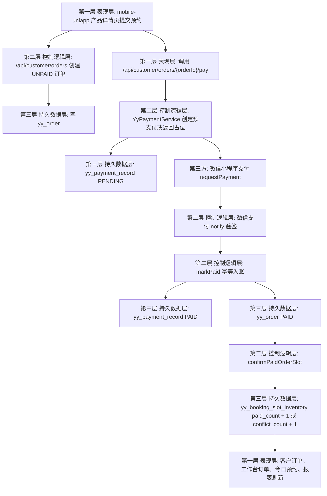
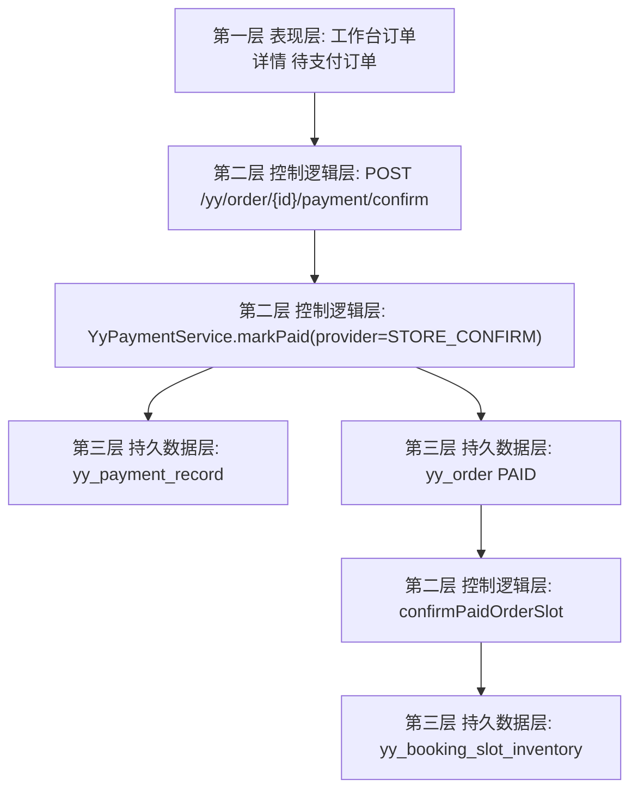

# 简约网完美复刻总计划：客户预约支付/收款闭环为第一阶段

生成时间：2026-06-23
最近修订：2026-06-24

## 1. 结论

本计划升级为 **简约网完美复刻总路线图**。第一阶段仍然优先完善 **客户预约支付/收款闭环**：

客户自助预约下单 -> 发起支付或门店确认收款 -> 写入支付流水 -> 更新订单支付状态 -> 确认档期库存 -> 客户端、工作台、今日预约、会员消费、收支统计刷新。

第一阶段不要先做会员储值、优惠券、积分、组合支付。原因是当前项目已经有订单、支付字段、支付流水表和库存确认底座，但支付接口仍是占位；只有先打通资金事实和库存事实，后续会员权益、卡券、营销、报表才有可靠账本。

完美复刻不是只复刻页面，而是把简约网已观察到的商户后台、消费者端、订单资金、会员资产、营销卡券、服务生产、报表、通知、平台对接和治理能力，全部落成可读写、可审计、可回滚、可验证的影约云闭环。

## 2. 已验证事实

- 产品功能清单把“档期并发控制”和“支付、退款、权益、档期一致性”列为 P0：`D:\Java\class\projectKu\codex-repo-guardrails\yingyue-cloud-feat-codex-repo-guardrails-20260623\docs\product-function-inventory(产品功能清单).md:287`、`:288`。
- 产品功能清单把 MVP 定义为“多门店、服务产品、档期、消费者预约、后台开单、微信支付、基础会员、优惠券、基础报表”：`D:\Java\class\projectKu\codex-repo-guardrails\yingyue-cloud-feat-codex-repo-guardrails-20260623\docs\product-function-inventory(产品功能清单).md:303`。
- 客户侧支付路由已存在：`POST /api/customer/orders/{orderId}/pay`，入口在 `D:\Java\class\projectKu\codex-repo-guardrails\yingyue-cloud-feat-codex-repo-guardrails-20260623\backend\ruoyi-modules\ruoyi-yy\src\main\java\org\dromara\yy\controller\YyClientPublicApiController.java:120`。
- 当前 `payCustomerOrder` 只校验订单归属并返回 `paymentReady=false`，不更新订单、不写支付流水：`D:\Java\class\projectKu\codex-repo-guardrails\yingyue-cloud-feat-codex-repo-guardrails-20260623\backend\ruoyi-modules\ruoyi-yy\src\main\java\org\dromara\yy\service\impl\YyClientPublicApiServiceImpl.java:311`。
- 移动端已经在产品详情页创建订单后调用 `payCustomerOrder`：`D:\Java\class\projectKu\codex-repo-guardrails\yingyue-cloud-feat-codex-repo-guardrails-20260623\mobile-uniapp\src\pages\product\detail\index.vue:167`、`:177`。
- 移动端支付占位工具会在 `paymentReady=false` 或 `timeStamp` 为空时阻止 `uni.requestPayment`：`D:\Java\class\projectKu\codex-repo-guardrails\yingyue-cloud-feat-codex-repo-guardrails-20260623\mobile-uniapp\src\utils\customer-payment-placeholder.mjs:7`。
- `yy_order` 已有 `total_amount_cent`、`paid_amount_cent`、`pay_status`、`paid_time` 字段：`D:\Java\class\projectKu\codex-repo-guardrails\yingyue-cloud-feat-codex-repo-guardrails-20260623\backend\script\sql\postgres\postgres_yy_cloud.sql:61`。
- `yy_payment_record` 已存在，并有 `(tenant_id, channel_type, out_trade_no)` 幂等唯一索引：`D:\Java\class\projectKu\codex-repo-guardrails\yingyue-cloud-feat-codex-repo-guardrails-20260623\backend\script\sql\postgres\postgres_yy_cloud.sql:285`、`:315`。
- `yy_booking_slot_inventory` 是真实时段容量账本：`D:\Java\class\projectKu\codex-repo-guardrails\yingyue-cloud-feat-codex-repo-guardrails-20260623\backend\script\sql\postgres\postgres_yy_cloud.sql:325`。
- 库存原子扣减已存在，条件是 `paid_count < capacity`：`D:\Java\class\projectKu\codex-repo-guardrails\yingyue-cloud-feat-codex-repo-guardrails-20260623\backend\ruoyi-modules\ruoyi-yy\src\main\resources\mapper\yy\YyBookingSlotInventoryMapper.xml:7`。
- 库存确认服务 `confirmPaidOrderSlot` 已存在，可复用：`D:\Java\class\projectKu\codex-repo-guardrails\yingyue-cloud-feat-codex-repo-guardrails-20260623\backend\ruoyi-modules\ruoyi-yy\src\main\java\org\dromara\yy\service\impl\YyBookingSlotInventoryServiceImpl.java:113`。
- 店员开单已有 `payStatus` 字段，已支付预约会走库存确认：`D:\Java\class\projectKu\codex-repo-guardrails\yingyue-cloud-feat-codex-repo-guardrails-20260623\backend\ruoyi-modules\ruoyi-yy\src\main\java\org\dromara\yy\domain\bo\YyStaffBookingCreateBo.java:52`、`D:\Java\class\projectKu\codex-repo-guardrails\yingyue-cloud-feat-codex-repo-guardrails-20260623\backend\ruoyi-modules\ruoyi-yy\src\main\java\org\dromara\yy\service\impl\YyOrderServiceImpl.java:154`。
- 微信生态当前仍是配置壳/预留能力，微信支付标记为 `RESERVED`：`D:\Java\class\projectKu\codex-repo-guardrails\yingyue-cloud-feat-codex-repo-guardrails-20260623\backend\ruoyi-modules\ruoyi-yy\src\main\java\org\dromara\yy\service\impl\YyWechatServiceImpl.java:45`。
- 当前未搜索到 `YyPaymentRecord` Java domain/mapper/service，执行时需要补代码层映射。

## 3. 目标与成功标准

目标：

- 客户自助订单可以从 `UNPAID` 变为 `PAID`。
- 支付成功或门店确认收款后必须有一条可审计的 `yy_payment_record`。
- 支付状态变更必须和档期库存确认联动。
- 重复支付回调、重复确认收款不能重复增加库存。
- 未配置微信支付时仍保留当前安全占位，不误拉起空支付，不误标已支付。

成功标准：

- 移动端下单后，支付未配置时仍看到明确提示；支付配置可用时可收到支付参数并拉起支付。
- 后端收到支付成功事件后，`yy_order.pay_status=PAID`，`paid_amount_cent` 和 `paid_time` 有值。
- `yy_payment_record` 有对应流水，重复回调不新增重复有效流水。
- 有完整时段的已支付订单会调用 `confirmPaidOrderSlot`。
- 满员时订单仍可记录已支付事实，但库存状态进入冲突，便于人工处理。

## 4. 三层楼数据流



门店确认收款分支：



## 5. 接口与契约

### 5.1 客户支付接口

保持现有路径：

```http
POST /api/customer/orders/{orderId}/pay
Authorization: Bearer <customer-token>
```

响应继续兼容移动端现有 `CustomerPaymentParams`：

```json
{
  "timeStamp": "",
  "nonceStr": "",
  "package": "",
  "signType": "",
  "paySign": "",
  "paymentReady": false,
  "message": "在线支付暂未接入，订单已创建，请到店或联系门店确认。",
  "transactionNo": "",
  "orderId": "9001",
  "orderNo": "YY-CUST-9001",
  "amount": 39900,
  "provider": "WECHAT_MINI_APP",
  "outTradeNo": "YYPAY-9001-xxx",
  "payStatus": "UNPAID",
  "paymentRecordId": "xxx"
}
```

规则：

- 微信支付配置可用时：`paymentReady=true`，返回 `timeStamp`、`nonceStr`、`package`、`signType`、`paySign`。
- 微信支付配置不可用时：`paymentReady=false`，保留安全占位，不更新订单为已支付。
- 订单已支付时：返回 `payStatus=PAID`，不重复创建支付。
- 抖音来客订单、已取消订单、已退款订单拒绝客户侧支付。

### 5.2 微信支付回调

新增路径建议：

```http
POST /api/customer/pay/wechat/notify
```

规则：

- 必须验签。
- 必须按 `out_trade_no` 找到 `yy_payment_record`。
- 验签失败、金额不一致、订单不存在时不更新订单，只记录失败原因。
- 回调成功调用 `YyPaymentService.markPaid(...)`。
- 返回微信平台要求的成功/失败响应格式，具体格式以实际 SDK/官方文档为准，实施前必须再次查官方文档。

### 5.3 工作台确认收款

新增路径建议：

```http
POST /yy/order/{id}/payment/confirm
```

请求：

```json
{
  "amountCent": 39900,
  "remark": "门店现金/转账已确认"
}
```

规则：

- 权限：`yy:order:edit`。
- 只允许 `UNPAID` 且未取消、未退款订单。
- provider v1 固定为 `STORE_CONFIRM`，不允许前端传任意第三方支付通道。
- 成功后写 `yy_payment_record`、更新 `yy_order`、确认库存。

## 6. 数据层约束

继续使用：

- `yy_order`：唯一订单/预约账本。
- `yy_payment_record`：小程序/微信/门店确认收款流水。
- `yy_booking_slot_inventory`：真实时段容量账本。

不新增：

- 第二套订单表。
- 第二套库存表。
- 会员储值账本。
- 优惠券核销账本。
- 积分账本。

幂等规则：

- 预支付流水唯一键使用现有 `(tenant_id, channel_type, out_trade_no)`。
- `out_trade_no` 规则固定为 `YYPAY-{orderId}-{snowflake}`。
- 回调重复到达时，如果流水已 `PAID`，直接返回已处理，不重复更新库存。
- 门店确认收款的 `out_trade_no` 规则固定为 `STOREPAY-{orderId}-{snowflake}`。

订单状态规则：

- 支付成功只更新支付字段：`pay_status=PAID`、`paid_amount_cent`、`paid_time`。
- 订单业务状态不强制从 `PENDING` 改到 `CONFIRMED`，避免和现有订单状态机冲突；是否确认服务由后续订单状态流转处理。
- 已支付订单取消时继续复用现有库存释放逻辑，退款闭环另开 Part。

库存规则：

- 有完整 `slot_date`、`slot_start_time`、`slot_end_time` 的已支付订单才确认库存。
- `confirmPaidOrderSlot` 返回 confirmed 时，订单库存状态为 `CONFIRMED`。
- 满员时记录冲突，不吞掉已支付事实，交由工作台人工处理。

## 7. 分 Part 执行计划

### Part 0：开工前边界确认

本 Part 必须先串行完成，作为 Part 1-6 并行开发的唯一契约来源。未完成 Part 0 前，不允许进入代码实现。

Part 0 交付物：

- 契约文档：`docs/contracts/customer-payment-inventory-closed-loop-contract-20260624.md`
- 数据流文档：`docs/flows/customer-payment-inventory-closed-loop-flow-20260624.md`
- 只读拷问记录：`docs/evidence/customer-payment-inventory-part0-readonly-review-20260624.md`

必须产出：

- 用户路径：客户自助下单支付、门店确认收款、微信支付回调、支付失败/取消、库存冲突、非法订单拒绝。
- 三层楼 Mermaid 数据流：表现层、控制逻辑层、持久数据层分别标明入口、字段、返回值和失败路径。
- 接口/对象契约：`YyPaymentService`、`CustomerPaymentParams`、微信 notify payload、工作台确认收款请求、错误码、错误文案、权限、幂等键、读写表。
- 任务包矩阵：每个 Part 的影响层级、允许修改文件、禁止触碰文件、验证命令、预期结果、PR 边界。
- 只读拷问记录：支付、数据库、权限、第三方回调属于高风险改动，开工前必须对契约做一次只读 review，确认不混用 `DOUYIN_LIFE` / `DOUYIN_MINI_APP`。

允许修改：

- `backend/ruoyi-modules/ruoyi-yy/src/main/java/org/dromara/yy/**`
- `backend/ruoyi-modules/ruoyi-yy/src/main/resources/mapper/yy/**`
- `backend/ruoyi-modules/ruoyi-yy/src/test/java/org/dromara/yy/**`
- `mobile-uniapp/src/api/customer.ts`
- `mobile-uniapp/src/types/clientPhoto.ts`
- `mobile-uniapp/src/utils/customer-payment-placeholder.mjs`
- `mobile-uniapp/tests/**`
- `studio-workbench/src/features/orders/**`
- `studio-workbench/src/shared/api/**`
- `docs/**`

禁止触碰：

- 抖音来客真实平台写入链路。
- 香港2部署脚本和生产配置。
- 会员储值、优惠券、积分、提现账本。
- 无关页面重构和大面积格式化。
- 真实 AppSecret、token、证书、完整手机号、openid、raw 私密 payload。

外部边界：

- 本轮不调用抖音真实平台。
- 本轮不部署香港2。
- 本轮不直接写生产库。
- 微信支付真实 SDK 接入前必须确认商户号、证书、回调地址和官方签名规范。

### Part 0.1：执行纪律层落地规则

本计划执行时必须按 `AGENTS.md` 的执行纪律层补充落地：

- 大任务拆成可独立完成、独立验证的小模块；每个 Part 都必须能单独跑至少一条验证命令。
- 修改前先明确影响层级：表现层、控制逻辑层、持久数据层。用户限定某一层时，不顺手改其他层。
- 跨模块、跨层或高风险改动前，先给出数据流、影响文件、执行步骤和验证方式。
- 涉及接口、字段、DTO、VO、数据库表、配置项、第三方对接时，先验证现有契约，再修改。
- 排障按三步走：先定位层级，再从入口追踪数据流，最后只修复确认的问题点和最小文件集合。
- 修改中保持边界克制：不做无关重构，不格式化无关文件，不覆盖用户已有改动。
- 修改后必须做可行验证，并记录改了什么、验证结果和剩余风险。

协作和提交纪律：

- 一个 PR 只做一个任务域；支付闭环、会员、营销、渠道、报表不得混在一个 PR。
- 大拆分优先独立 worktree 或明确任务包；同一文件多人/多 Agent 并行修改前必须先拆 owner。
- 提交时只能 `git add <明确文件路径>`，禁止 `git add .`。
- 禁止 `git reset --hard`、`git checkout -- <file>`、force push 未沟通分支。
- 不提交 `.env*`、token、secret、完整手机号、openid、大量本机 `docs/evidence/*`、`dist/`、`target/`、`.headroom/`。
- 如果当前目录不是 git 仓库，先定位真实仓库根目录；不能用“没有 git 状态”掩盖文件变更风险。

数据和平台边界：

- `yy_order` 是唯一订单/预约账本。
- `yy_booking_slot_inventory` 是真实时段和容量账本。
- `yy_payment_record` 是本轮支付/收款流水账本，不新增第二套订单或库存账本。
- 历史 `DOUYIN_LIFE` 订单没有真实 `slot_date/slot_start_time/slot_end_time` 时，不得写入每日排期。
- `DOUYIN_LIFE` 不等于 `DOUYIN_MINI_APP`，不得混用接口、渠道和支付回调。
- 不记录、不提交、不输出 AppSecret、token、完整手机号、openid、raw 私密 payload。
- 本轮不部署香港2，不调用真实抖音平台；真实平台验收必须有安全测试目标或沙箱。

### Part 0.2：Part 1-6 并行任务包矩阵

Part 0 完成并锁定契约后，Part 1-6 可以并行开发，但最终必须按 `Part 1 -> Part 2/3 -> Part 4/5 -> Part 6` 顺序集成验收。

| Part | 影响层级 | 依赖 | 允许修改重点 | 禁止触碰 | 最小验证与预期结果 |
| --- | --- | --- | --- | --- | --- |
| Part 1 后端支付核心服务 | 第二层 + 第三层 | Part 0 契约 | `ruoyi-yy` 支付 service/domain/mapper/test，`yy_payment_record` Java 映射 | 移动端 UI、工作台 UI、抖音真实平台、会员/卡券/积分账本 | Maven 目标测试通过；首次支付、重复回调、金额不一致、库存满员均有断言 |
| Part 2 客户侧支付接口 | 第二层 | Part 0 契约、Part 1 service 接口 | `YyClientPublicApiServiceImpl`、客户支付 controller/test | 不直接写库存 SQL，不绕过 `YyPaymentService.markPaid` | 客户支付接口测试通过；未配置微信时不标记已支付 |
| Part 3 支付成功入口 | 第二层 | Part 0 契约、Part 1 markPaid | 微信 notify adapter、工作台确认收款 controller/service/test | 不接真实生产微信证书，不写真实抖音/美团回调 | notify 重放不重复加库存；门店确认收款写 `STORE_CONFIRM` |
| Part 4 移动端联动 | 第一层 + 第二层前端 API | Part 0 响应契约 | `mobile-uniapp` 类型、API、支付 placeholder、订单页支付动作/test | 不修改后端、不引入真实密钥、不绕过 `paymentReady` | `npm --prefix mobile-uniapp run test` 和 `typecheck` 通过 |
| Part 5 工作台确认收款 | 第一层 + 第二层前端 API | Part 0 请求契约、Part 3 endpoint | `studio-workbench` 订单详情动作、API facade、状态刷新/test | 不改会员/营销/报表派生逻辑，不做退款闭环 | 订单相关 vitest 通过；待支付才显示确认收款 |
| Part 6 文档和地图 | 文档/治理 | 所有 Part 结果 | 本计划、契约文档、功能/接口/优化/对标地图、验收记录 | 不改业务代码，不提交敏感证据 | `rg` 检索到接口、状态、幂等、权限、读写表、验证命令 |

并行冲突处理：

- `YyClientPublicApiServiceImpl`、订单服务、移动端 `customer.ts`、工作台订单 API facade 属于高冲突文件；同一时段只允许一个 Part 持有写权限。
- 如果目标文件超过项目文件体积上限，不继续堆代码，改为新增 owner 文件并在任务包写明迁移路径。
- Part 2/3/4/5 不得各自实现支付状态更新；所有支付成功事实必须收敛到 Part 1 的 `markPaid(...)`。
- Part 4/5 可先按契约做 mock 或 facade，但合并前必须接真实接口跑目标测试。

### Part 0.2.1：Part 3 已执行任务包落点

Part 3 本轮已按显式任务包执行，落点文档为：

- `docs/domestic-model-tasks/DM-API-005-payment-entry-part3-task-pack-20260624.md`

该任务包已补齐：

- 允许修改文件/目录
- 禁止触碰文件/目录
- 是否允许写库、调用抖音、部署香港 2
- 地图更新结论
- 验证命令与预期结果
- 当前主工作树执行原因与“非本任务改动仍存在”的边界说明

### Part 0.3：执行闸门和暂停条件

执行闸门：

- Gate A：Part 0 的用户路径、三层楼数据流、接口契约、读写表、权限和幂等键全部写清后，才能进入 Part 1-6 代码实现。
- Gate B：Part 1 的 `markPaid(...)`、支付流水唯一键、库存确认幂等测试通过后，Part 2/3 才能合并。
- Gate C：Part 2/3 只能调用 Part 1 统一服务，不允许新增第二套支付状态更新或库存确认入口。
- Gate D：Part 4/5 可以先按 Part 0 契约做前端 mock/facade，但合并前必须接真实接口并跑目标测试。
- Gate E：Part 6 必须按清单更新计划、契约、流程、功能地图、接口地图、优化地图和验收记录后，才算本阶段完成；外部 canonical map 不存在时，必须在仓库内留下“无法验证/无法更新”的受阻记录，不能编造路径或替代文件。

暂停条件：

- 支付配置、商户号、证书、回调域名或微信官方签名规范无法确认时，暂停真实微信支付实现，只保留 `paymentReady=false` 或沙箱路径。
- 无法证明支付回调、门店确认收款、库存确认的幂等性时，暂停合并 Part 1/3。
- 发现库存重复确认、超卖、已取消订单被支付、抖音来客订单误入客户支付入口等风险时，先定位层级和数据流，再做最小修复。
- 任何实现需要触碰真实抖音平台、香港2生产部署、生产库、会员/卡券/积分/退款账本时，暂停本计划并另开高风险任务包。
- Maven、npm 依赖或目标测试无法运行时，不得声称完成；必须记录失败命令、错误摘要、影响范围和下一步恢复办法。

### Part 1：后端支付核心服务

实现内容：

- 新增 `YyPaymentRecord` domain、mapper、VO/BO 或最小必要对象。
- 新增 `IYyPaymentService` 和 `YyPaymentServiceImpl`。
- 新增 `createPrepayForCustomerOrder(...)`，负责创建或复用 `PENDING` 支付流水。
- 新增 `markPaid(...)`，统一处理支付成功事实。
- `markPaid(...)` 内部必须同事务执行：锁定/读取订单、幂等处理流水、更新订单、调用 `confirmPaidOrderSlot`。

验收：

- 单元测试覆盖首次支付、重复回调、金额不一致、订单已取消、库存满员。

### Part 2：客户侧支付接口升级

实现内容：

- 改造 `YyClientPublicApiServiceImpl.payCustomerOrder`。
- 保持现有接口返回字段兼容。
- 未配置微信小程序支付时继续返回 `paymentReady=false`。
- 可配置时返回真实小程序支付参数。

验收：

- 现有测试 `payCustomerOrderShouldReturnPlaceholderWithoutMarkingPaid` 更新为“未配置支付时返回占位且不标记已支付”。
- 新增“已配置支付时返回 `paymentReady=true` 且写入 PENDING 流水”测试。

### Part 3：支付成功入口

实现内容：

- 新增微信支付 notify controller/service adapter。
- 验签逻辑独立封装，便于测试和替换 SDK。
- 回调只通过 `YyPaymentService.markPaid(...)` 改订单和库存。
- 新增工作台门店确认收款接口 `POST /yy/order/{id}/payment/confirm`。

验收：

- notify 重放不重复加库存。
- 门店确认收款会写 `STORE_CONFIRM` 流水。
- 抖音来客订单不允许通过本接口确认收款。

### Part 4：移动端联动

实现内容：

- 更新 `CustomerPaymentParams` 类型，增加 `provider`、`outTradeNo`、`payStatus`、`paymentRecordId`。
- `paymentReady=true` 时才调用 `uni.requestPayment`。
- 支付成功后跳转订单页并刷新。
- 支付失败/取消时提示用户可在订单页继续支付。
- 未配置支付时沿用当前占位提示，不误拉支付。

验收：

- `mobile-uniapp/tests/customer-payment-placeholder.test.cjs` 覆盖 `paymentReady=true + timeStamp`。
- `npm --prefix mobile-uniapp run test` 通过。
- `npm --prefix mobile-uniapp run typecheck` 通过。

### Part 5：工作台确认收款

实现内容：

- 在订单详情或待支付操作区增加“确认收款”动作。
- 仅 `待支付`、未取消、未退款订单显示。
- 成功后刷新订单列表、详情、今日预约统计。
- 文案明确“这是门店确认收款，不是第三方平台支付”。

验收：

- 前端测试覆盖按钮显隐、接口调用、成功刷新、失败提示。
- 不影响现有取消、改期、到店、服务中、完成状态流转。

### Part 6：文档和地图

实现内容：

- 更新本文件执行结果。
- 新增或更新支付契约文档。
- 更新项目功能地图、优化地图、简约对标地图。
- 本 Part 只做文档/地图/验收收口，不新增任何 `controller`、`service`、`store`、`composable` 脚手架。

已验证事实：

- `POST /api/customer/pay/wechat/notify` 已有 controller owner：`backend/ruoyi-modules/ruoyi-yy/src/main/java/org/dromara/yy/controller/YyWechatPaymentNotifyController.java:23`。
- `POST /yy/order/{id}/payment/confirm` 已有 controller owner：`backend/ruoyi-modules/ruoyi-yy/src/main/java/org/dromara/yy/controller/YyOrderPaymentController.java:34`。
- 统一 paid-entry service 契约已存在：`backend/ruoyi-modules/ruoyi-yy/src/main/java/org/dromara/yy/service/IYyPaymentService.java:12`。
- 移动端支付占位仍兼容 `paymentReady=false`：`mobile-uniapp/src/api/customer.ts:191`。
- 工作台确认收款前端入口已存在：`studio-workbench/src/shared/api/backend.ts:479`。

执行补充：

- 补齐 `docs/flows/customer-payment-inventory-closed-loop-flow-20260624.md` 中的 code owner 对齐信息。
- 新增 Part 6 验收记录，写明验证命令、受阻项和剩余风险。
- 外部 canonical map 仅在文件真实存在时更新；不存在时只记录阻塞，不创建猜测版地图。

验收补充：

- 本计划、契约文档、流程文档、Part 6 验收记录均已更新。
- `rg` 可检索到接口、状态、幂等、权限、读写表和验证命令。
- 外部 canonical map 存在时已更新；不存在时已在仓库内留下受阻记录和证据引用。
- 本机检查过 `C:\Users\Administrator\Desktop\yiyue\*.md` 地图文件，当前路径未找到；执行时如果仍不存在，先创建缺失目录/文件，再写入本轮变更摘要。

验收：

- 文档中明确接口、状态、幂等、权限、读写表、验证命令。

## 8. 测试计划

后端目标测试：

```powershell
cd D:\Java\class\projectKu\codex-repo-guardrails\yingyue-cloud-feat-codex-repo-guardrails-20260623\backend
mvn -pl ruoyi-modules/ruoyi-yy -am "-Dtest=YyClientPublicApiServiceImplTest,YyPaymentServiceImplTest" "-DskipTests=false" "-Dsurefire.failIfNoSpecifiedTests=false" test
```

移动端测试：

```powershell
npm --prefix mobile-uniapp run test
npm --prefix mobile-uniapp run typecheck
```

工作台测试：

```powershell
npm --prefix studio-workbench run test -- src/features/orders src/shared/api
npm --prefix studio-workbench run build
```

文件体积检查：

```powershell
npm --prefix mobile-uniapp run check:file-size
npm --prefix studio-workbench run check:file-size
```

## 9. 手工验收场景

场景 1：未配置微信支付

- 客户提交预约。
- 系统生成 `UNPAID` 订单。
- 点击支付返回 `paymentReady=false`。
- 不调用 `uni.requestPayment`。
- 订单仍是待支付，库存不增加。

场景 2：门店确认收款

- 工作台打开待支付订单。
- 点击“确认收款”。
- 系统写 `STORE_CONFIRM` 支付流水。
- 订单变为已支付。
- 有完整时段时库存 `paid_count + 1`。
- 客户订单页刷新为已支付。

场景 3：微信支付成功

- 客户发起支付，后端生成 `PENDING` 流水。
- 微信回调验签成功。
- 系统写 `PAID`，更新订单，确认库存。
- 重放同一回调，不重复加库存。

场景 4：库存满员

- 支付成功时目标时段容量已满。
- 订单支付事实仍记录为已支付。
- 库存冲突数增加。
- 工作台可看到冲突订单，人工处理改期或退款。

场景 5：非法订单

- 已取消订单、已退款订单、抖音来客订单调用客户支付或门店确认收款。
- 后端拒绝，并返回明确错误。
- 不写支付流水，不改库存。

## 10. 风险与兼容策略

- 风险：微信支付真实 SDK 需要商户资料、证书、回调域名和官方签名规范。策略：先完成统一支付服务和门店确认收款，微信真实支付在配置齐全后启用。
- 风险：支付成功但库存满员。策略：支付事实优先入账，库存状态标记冲突，工作台人工处理。
- 风险：重复回调导致超卖。策略：以 `yy_payment_record` 唯一键和 `markPaid` 幂等保护，库存确认只允许从未确认变为确认。
- 风险：订单状态机和支付状态混用。策略：支付只改 `pay_status`，不强行推进 `status`。
- 风险：会员权益、优惠券、退款依赖支付事实。策略：本轮不做这些账本，只留下后续扩展点。

## 11. 支付闭环阶段明确不做

- 支付闭环阶段不做储值充值、余额支付、组合支付。
- 支付闭环阶段不做优惠券领取、发放、核销、退券。
- 支付闭环阶段不做积分、成长值、会员卡权益扣减。
- 支付闭环阶段不做退款审批和退款回调闭环。
- 支付闭环阶段不做抖音小程序 `tt.pay`。
- 支付闭环阶段不混用 `DOUYIN_LIFE` 和 `DOUYIN_MINI_APP`。
- 支付闭环阶段不部署生产，不调用真实抖音平台。

## 12. 默认假设

- 第一优先级是“可审计、可幂等、可验证”的支付/收款闭环。
- 微信小程序支付作为接口能力预留，真实启用取决于商户配置。
- 门店确认收款用于本地和工作台闭环验证，但必须在流水中标记为 `STORE_CONFIRM`，不能伪装成第三方支付。
- 后续会员、卡券、积分、报表增强都以本轮 `yy_payment_record + yy_order.pay_status + yy_booking_slot_inventory` 为基础。

## 13. 完美复刻完成定义

完美复刻完成时，以下能力必须同时满足：

- 菜单和入口覆盖简约网已观察到的首页、商户、商品、订单、服务、资源、会员、营销、统计、设置、应用商城。
- 关键页面不是占位页：每个页面至少具备查询、筛选、空态、加载态、失败态、权限不足态和真实后端数据来源。
- 写操作必须落库并可审计：保存、支付、退款、改期、取消、发券、核销、导出、批量开卡、通知发送、平台回调都要有操作日志或业务流水。
- 金额和资产必须可对账：订单金额、支付流水、退款流水、优惠减免、储值、卡券、权益核销、报表金额口径一致。
- 档期、支付、退款、权益、库存必须事务一致，不能出现已退款仍占库存、已支付未入账、权益核销无明细等情况。
- 多门店、多角色、多渠道数据范围必须隔离，后台列表、导出、详情、操作接口都必须走同一权限规则。
- 消费者端、工作台、渠道平台、通知中心、报表的状态必须互相刷新，不允许只在一个页面“看起来正确”。
- 每个复刻模块必须有目标测试、接口契约、读写表说明和至少一条人工验收路径。

## 14. 完美复刻总路线图

### Phase 1：P0 预约资金库存闭环

目标：

- 完成本文件 Part 0 到 Part 6。
- 打通客户自助预约、微信/门店收款、支付流水、订单支付状态、档期库存确认。
- 补齐待支付、已支付、库存冲突、支付占位、重复回调、门店确认收款的测试。

完成后仍不是完美复刻，只是具备承接会员、卡券、退款、报表的资金和库存底座。

### Phase 2：退款、退单、改期和权益反向闭环

目标：

- 实现预约设置中的未支付自动取消、自助改期、自助退单、阶梯退款、改期后退单规则。
- 新增退款流水或扩展支付流水，支持全额退款、部分退款、拒绝退款、退款中、退款失败。
- 取消和退单必须联动释放库存、恢复优惠券、恢复权益次数、回滚积分或成长值。
- 工作台订单详情补齐退款申请、退款审核、退款结果、渠道退款证据和操作审计。

验收：

- 已支付订单取消必须进入退款路径，不能只改订单状态。
- 阶梯退款规则按预约时间、改期次数、渠道、支付方式计算。
- 重复退款回调不重复退款、不重复释放权益。

### Phase 3：会员资产和卡项产品真账本

目标：

- 新增会员账户、会员卡、次卡、共享次卡、储值卡、余额、积分、成长值、权益核销明细等真账本。
- 工作台会员信息页从派生视图升级为真实资产页，支持会员详情、办卡、发券、标签、交易明细。
- 消费者端“我的”展示会员资料、等级、卡项、优惠券、积分、余额、交易明细。
- 储值充值、消费、提现先进入合规设计和审批流；未确认合规前只允许演示或关闭。

验收：

- 每一次权益扣减都能追溯到订单、产品、客户、门店、操作人和退单策略。
- 会员余额和储值流水不能只存在于订单备注或派生字段。
- 批量开卡、余额调整、积分调整必须有审批或高风险审计。

### Phase 4：优惠券、兑换券和营销活动闭环

目标：

- 实现优惠券模板、优惠码、兑换券、发券、领券、核销、过期、退单恢复。
- 实现砍价、秒杀、拼团、限时折扣的最小可交付版本。
- 下单前提供优惠试算：可用、不可用原因、最优组合、互斥和叠加规则。
- 订单支付前可预占券、权益和活动库存，超时自动释放。

验收：

- 优惠金额、券核销、权益扣减、支付金额和报表金额完全一致。
- 拼团失败、秒杀超时、活动取消必须能自动退款和释放库存。
- 营销页不再只从 `yy_order` 派生线索，而是读真实营销账本。

### Phase 5：第三方渠道插件复刻

目标：

- 微信平台对接补齐公众号、小程序、微信支付、消息通知、商户助手。
- 抖音、美团、小红书作为插件化渠道，分别管理商品映射、订单同步、核销、退款、回调和日志。
- 明确 `DOUYIN_LIFE`、`DOUYIN_MINI_APP`、`WECHAT_MINI_APP`、`MEITUAN` 的支付和订单边界。
- 应用商城、套餐授权、渠道开通状态和灰度策略产品化。

验收：

- 渠道订单和本地订单有唯一映射、幂等回调和可查日志。
- 美团验券、抖音来客支付/预约/核销、小红书入口不能混用接口。
- 未开通渠道必须显示授权/套餐状态，不允许假数据。

### Phase 6：服务生产、在线选片和内部协作

目标：

- 在线选片支持上传、通知客户、客户选片、门店确认、交付、下载通知。
- 客片管理支持相册、底片、精修、下载、水印、访问权限和生命周期。
- 内部协作支持接待、化妆、摄影、修图、审片、看片、取件岗位工单。
- 三方修图中心支持下单、派单、服务商、报价、验收、结算。

验收：

- 每个工单都可追踪订单、员工、岗位、状态、开始/完成时间和异常原因。
- 选片、修图、取件状态能回写订单详情和报表。
- 文件访问必须走私有存储、签名 URL、水印和权限控制。

### Phase 7：报表、导出和财务对账

目标：

- 统一经营概况、预约概况、服务产品统计、员工业绩、修图量、收支统计、客户分析、评价、渠道收入、销售分析、订购分析口径。
- 新增财务对账报表，对齐订单、支付、退款、储值、优惠、减免和第三方流水。
- 报表导出进入异步任务中心，支持权限、脱敏、过期下载和审计。

验收：

- 首页收入、订单列表销售额、收支统计、财务对账结果可解释且一致。
- 导出任务可追踪申请人、筛选条件、生成时间、下载次数和过期时间。

### Phase 8：通知中心、系统设置和平台治理

目标：

- 通知中心支持微信、短信、邮件、站内信、失败重试、退订和资费提示。
- 通知场景覆盖订单临期、订单完成、底片下载、优惠券临期、卡项权益临期、退款结果。
- 设置页补齐平台对接、预约设置、打印设置、评分配置、邮箱设置、员工管理、系统日志。
- 平台治理补齐多租户品牌、套餐插件、RBAC、数据范围、审批流、操作审计、开放 API、Webhook、异步任务、备份恢复、可观测性。

验收：

- 通知发送必须有模板、接收人、渠道、发送结果、失败原因和重试记录。
- 高风险动作必须可审批、可审计、可回滚。
- 开放 API 和 Webhook 必须有签名、幂等、限流和事件日志。

## 15. 完美复刻优先级

优先级按资金风险和业务依赖排序：

1. P0：支付/退款/权益/档期一致性、档期并发、权限数据范围、操作审计。
2. P1：会员资产真账本、卡券试算和核销明细、第三方渠道插件、报表对账统一口径。
3. P2：自动化通知中心、开放 API/Webhook、文件生命周期和水印、异步任务中心。
4. P3：应用商城套餐化、三方修图结算、企业版 BI、连锁品牌治理。

执行纪律：

- 每个 Phase 单独开任务包，不允许一个 PR 同时做支付、会员、营销、渠道和报表。
- 每个 Phase 开工前必须补契约文档、Mermaid 数据流、读写表、权限、幂等和验收命令。
- 每个 Phase 完成后必须更新产品功能清单、功能地图、接口地图、优化地图和简约对标地图。

## 16. 完美复刻验收矩阵

| 模块 | 完美复刻验收点 | 必须读写的核心账本 |
| --- | --- | --- |
| 首页经营概况 | 收入、退款、订单、预约、转化和二维码与真实业务一致 | `yy_order`、`yy_payment_record`、退款/报表快照 |
| 预约订单 | 高级筛选、导出、看板、新增、收款、退款、改期、取消、状态流转 | `yy_order`、`yy_booking_slot_inventory`、支付/退款流水 |
| 商品产品 | 服务、附加、团单、冲印、入册、卡项、渠道产品映射 | `yy_product`、渠道映射、卡项产品账本 |
| 会员 | 会员信息、标签、等级、积分、成长值、余额、卡项、交易明细 | `yy_customer`、会员资产、积分、余额、卡项账本 |
| 营销 | 优惠券、优惠码、兑换券、发券宝、砍价、秒杀、拼团、限时折扣 | 券模板、券实例、活动、参与、核销账本 |
| 服务生产 | 在线选片、客片、修图、岗位工单、三方修图 | 相册、文件、工单、服务商、结算账本 |
| 统计报表 | 门店、产品、员工、修图、收支、客户、评价、渠道、订购 | 报表快照、订单、支付、退款、权益、渠道流水 |
| 设置平台 | 平台对接、预约规则、通知、打印、评分、邮箱、员工、日志 | 配置表、通知模板、权限、审计日志 |

## 17. 完美复刻外部验收边界

- 简约网对标只做只读观察，不执行保存、支付、退款、核销、发券、充值、提现等写操作。
- 抖音、美团、小红书、微信等真实平台验收必须使用安全测试门店、测试商品、测试订单或平台沙箱。
- 本地网络不能作为抖音 OpenAPI 失败的最终证据；生产平台链路仍按香港2和真实 logid 证据验收。
- 不记录、不提交、不输出 AppSecret、token、完整手机号、openid、raw 私密 payload。
